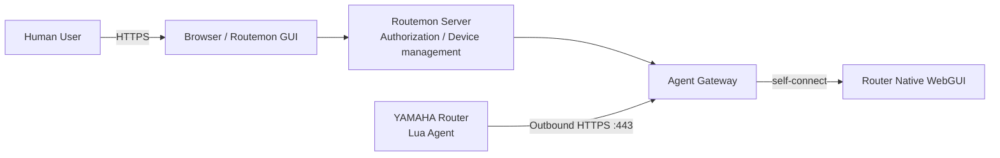

# Routemon Architecture

Status: Current architecture overview  
Scope: Overview  
Last updated: 2026-09-15

## 1. Purpose

本ドキュメントは、Routemon全体のhigh-level architecture overviewである。詳細は各設計書へリンクする。

どの文書を正本として読むかは`docs/README.md`を参照する。

---

## 2. Product boundary

Routemonは、YAMAHA RTX / NVR等をインターネット越しに集中管理するための軽量な管理基盤である。

- 小〜中規模のYAMAHAルーター管理を主対象とする
- 数百〜数千台級の単一Tenant運用や、大規模組織向けの高度な運用は本家YNOを推奨する
- 大規模Tenant向けの機能を無制限に取り込まない
- 本家YNOの完全な模倣やプロトコル互換実装を目的とせず、公開API / 公開仕様と実機挙動に基づく独立実装とする

対象ユーザーは`docs/product/service-policy.md`を正本とする。

---

## 3. Structure

```text
Routemon
├ Shared Core
│  ├ Agent Gateway
│  ├ Agent Protocol
│  ├ Device Enrollment
│  ├ Device Profile / Parser
│  └ WebGUI Relay
└ Community / Self-Hosted
```

Coreは、deployment方式に依存しない共通の仕様である。Communityは、Coreに従うSelf-Hosted版の実装である。



---

## 4. Shared Core

- ルーター単体で完結し、拠点内補助機器・inbound port forward・固定グローバルIPを要求しない
- Router側から開始するoutbound HTTPS/TCP 443(`rt.httprequest()`によるHTTPS sync)を標準管理チャネルとする
- Router AgentはHTTPS sync、frame transport、`rt.command()`、CONFIG / SYSLOGの取得・送信、WebGUI relayだけを担うthin data-plane agentとする。CONFIG parserやDevice Profile判定はServer側で行う
- Agent GatewayはAgentのHTTPS syncを終端し、Presence・stream・Data Planeを扱う。Gatewayに復旧不能な永続stateを置かない
- Device ProfileはConfiguration facts、Runtime Status、Gateway Observationを合成して生成する
- AgentはBootstrap / Supervisor + A/B slotで更新し、current stableを直接上書きしない
- WebGUI relayはRouter自身のWebGUIだけを対象とし、Native WebGUIはAdmin onlyとする
- RoleはAdmin / Viewerの2種類だけとし、Routemon独自GUIをPrimary UX、Native WebGUIをAdvanced accessとする

詳細は`docs/core/architecture.md`を参照する。

---

## 5. Community / Self-Hosted

| | Community / Self-Hosted |
|---|---|
| Tenant | 1 Instance = 1 Tenant |
| Deployment | Docker Compose(`routemon` + `caddy`)の単一Server |
| Authentication | Local Authのみ |
| Persistent data | SQLite + Local filesystem(`/data`) |
| Agent Gateway | Routemon Server内のcomponent |
| 文書 | `docs/community/architecture.md` |

---

## 6. Architecture decisions

| ADR | Scope | Decision |
|---|---|---|
| `docs/adr/0001-https-agent-transport.md` | Core | Agent標準TransportにHTTPSを採用する |
| `docs/adr/0006-server-implementation-stack.md` | Core | Routemon ServerをTypeScript(Node.js)で実装する |

---

## 7. Key documents

- Product: `docs/product/service-policy.md`、`docs/product/feature-list.md`、`docs/product/licensing-policy.md`
- Core: `docs/core/agent-protocol.md`、`docs/core/agent-gateway-design.md`、`docs/core/access-control-design.md`、`docs/core/device-enrollment-design.md`、`docs/core/device-profile-discovery-design.md`、`docs/core/agent-update-design.md`、`docs/core/webgui-relay-design.md`、`docs/core/data-model.md`、`docs/core/config-backup-design.md`、`docs/core/syslog-design.md`
- Agent Protocol: `docs/core/agent-protocol.md`
- Implementation status: `docs/core/architecture.md` §13
- Server implementation: `apps/community/`、`packages/core/`(Agent Protocol)、`packages/gateway/`(Agent Gateway)(ADR-0006)
- Router側のAgent / Supervisor / loader: `agent/`
