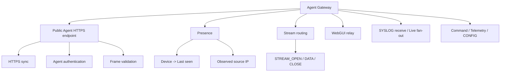

# Agent Gateway Design

Status: Current specification  
Scope: Core  
Last updated: 2026-09-15

Related:

- `docs/adr/0001-https-agent-transport.md`
- `docs/core/data-model.md`(§5 Presence semantics)
- `docs/core/webgui-relay-design.md`
- `docs/core/syslog-design.md`
- Agent Protocol: `docs/core/agent-protocol.md`

## 1. Definition

Agent Gatewayは、YAMAHA AgentのHTTPS syncを終端し、Agent Protocol、ephemeral stream、Presence等を扱う論理コンポーネントである。

```text
Community:
  Self-Hosted Routemon Server内のcomponentとして実装する
  (docs/community/installation-setup-design.md の構成図)
```

Core文書中の`Gateway`はこの論理コンポーネントを指す。

---

## 2. Responsibilities

- Agent HTTPS sync termination
- Agent authentication boundary
- protocol framing / routing
- ephemeral stream state
- Presence observation
- WebGUI relay / command等のData Plane入口



Frame / Typeの定義はAgent Protocol(`docs/core/agent-protocol.md`)に従う。

---

## 3. Public Agent endpoint

要件:

- InternetからYAMAHA Routerが直接到達可能
- standard trusted TLS certificate
- TCP/443
- TLS終端は、RTX830の`rt.httprequest()`が接続できるものにする。`rt.httprequest()`はCloudflare Workers / Tunnel系エッジへ接続できない(TLS handshake_failure)ため、それらでの終端を前提にしない(Community: 同一ServerのCaddy)
- Agent API以外の管理endpointを同じpublic listenerへ露出しない

Security:

- per-Device credential必須
- request / body / frame size validation
- malformed frame / oversized body / invalid Stream ID等をreject
- rate limitingを検討

---

## 4. Agent configuration

Agentは少なくとも以下を保持する。

```text
device_id
credential
Agent Gateway endpoint URL
```

`tenant_id`をAgent側の権限情報として信用しない。Device -> Tenantは常にserver-sideで解決する。

Agent Gateway endpointはEnrollment成功時にAgentへ渡す(`docs/core/device-enrollment-design.md`)。

### 4.1 Device credentialのキャッシュ

Agentのsyncは待機中でも約20秒ごとに届き、毎回credentialの確認が必要になる。確認のたびに、別のserviceにある取得元へ問い合わせると、リクエスト数が多すぎて成り立たない。取得元が別に存在する構成では、`CachedDeviceStore`(`packages/gateway`、#156)で、credentialのhashと状態をGatewayが持つ。Communityは、同じprocessのSQLiteを直接参照するため、使わない。

- **取得元はinterfaceで差し替える**(`CredentialSource`)。`fetchChanges(since)`は、前回のversion(取得元が決める不透明なcursor)以降の変更を返す。`lookup(hash)`は、未知のTokenを問い合わせる
- **定期取得:** 既定5分ごとに、前回のversionからの**差分**を取得して反映する。失効は、状態を持つentryとして届き、キャッシュに残る(失効済みのTokenは、取得元へ問い合わせずに拒否する)
- **未知のTokenが来たとき:** その場で取得元へ1回だけ問い合わせる(同時の問い合わせは1回にまとめる)。無かったTokenは、30秒は再度問い合わせない。新規登録したDeviceは、取得間隔を待たずに接続できる。取得元に届かないときは、拒否するが、すぐに再度問い合わせられる
- **取得元の障害時:** 復旧するまで、古いキャッシュを使い続ける。時間による打ち切りは設けない。取得の失敗が続いていることは、`status()`(失敗の回数、最後の成功時刻、直前のエラー)で分かる。運営者への通知は、health / statusの報告(#157)で行う
- **復旧時:** 最初に成功した取得で、差分を反映する。差分を返せないほど間が空いた場合は、取得元が`full: true`で全件を返し、キャッシュを置き換える(取得元に無くなったentryは消える)
- **永続化:** diskへ保存し(一時fileへ書いてからrename、権限0600)、Gatewayの再起動後も使える。保存するのはhashだけで、Token平文は持たない。壊れたfileは無視し、取得元から全件を取得する

失効時のpush通知は入れない(反映は定期取得に任せる)。

---

## 5. Presence

Agent GatewayはAgentの観測状態を保持する。

```text
presence[device_id]
- last_seen_at
- observed_source_ip
- active_transport_state
```

Presenceの意味、生存証明として扱う通信、Derived status(Online / Unstable / Offline / Unknown)は`docs/core/data-model.md` §5に従う。判定に使うtimeoutは`docs/core/agent-protocol.md` §10に従い、syncが来ないDeviceも定期的に再判定する。

---

## 6. Gateway state is disposable

Agent Gatewayには、失うとDevice管理を復旧不能にする永続状態を置かない。Gatewayが保持するのは、失われても再構築できるリアルタイム状態だけである。

Gateway再起動で失われてよいもの:

- live Agent Presence
- active WebGUI session
- stream state
- active Live Logs session
- transient request / response state

Gateway再起動直後はPresenceが空になるため、Agentの状態を一時的にUnknownとし、次のAgent sync / heartbeat受信後に復帰させる。

永続データの正本は、Serverの永続storageに置く。

---

## 7. Gateway health

Agent Gateway自体が異常な場合、その配下Deviceを一律にAgent Offlineと断定しない。

```text
Gateway healthy
+ Agent timeout
=> Agent Offline

Gateway unavailable / health unknown
+ Agentを観測できない
=> Agent Status Unknown
```

これによりDevice側障害とRoutemon基盤側障害を区別する。

### 7.1 health / statusの定期報告

Gatewayは、一定間隔(既定1分)で、自身のhealth / statusを、別のserviceへ報告する(`HealthReporter`、`packages/gateway`、#157)。報告が途絶えたことを、受け取る側がGatewayの異常(停止、VPSの障害、ネットワーク断)として検知できる。

- 送信先と認証は`HealthSink`で差し替える。`HttpHealthSink`は、JSONを、Gateway固有のcredentialをBearerで付けてPOSTする(送信先は、利用する側が決める)
- 報告の内容: `gatewayId`、version、時刻、uptime、processのmemory、Agent HTTPS listenerの状態、Deviceのpresenceの内訳、credentialキャッシュの状態(件数、最後に取得に成功した時刻、連続の失敗回数、直前のエラー。更新の失敗が続いていることが分かる)、SYSLOG spoolの使用量と破棄した件数、system(load average、memory、diskの空き)
- **送信の失敗は、Agentのsyncに影響させない。** 送信は別のtimerで行い、失敗は吸収してlogに残す(`report()`はfalseを返す)。前回の送信が終わっていなければ重ねず、取得できない項目は省略する
- 受信側(heartbeat途絶の検知と通知など)は、利用する側の実装。Communityは、受信側が無いため使わない

---

## 8. Server-side API and Agent Gateway

Server-side APIは、Command、WebGUI session開始、Presence問い合わせ、Live Logs制御等をAgent Gatewayへ依頼し、Agent GatewayがAgentのHTTPS syncへ載せる。

Server-side APIとAgent Gateway間の通信方式は、deploymentごとに定義する(Communityは、同一process内の呼び出し)。
