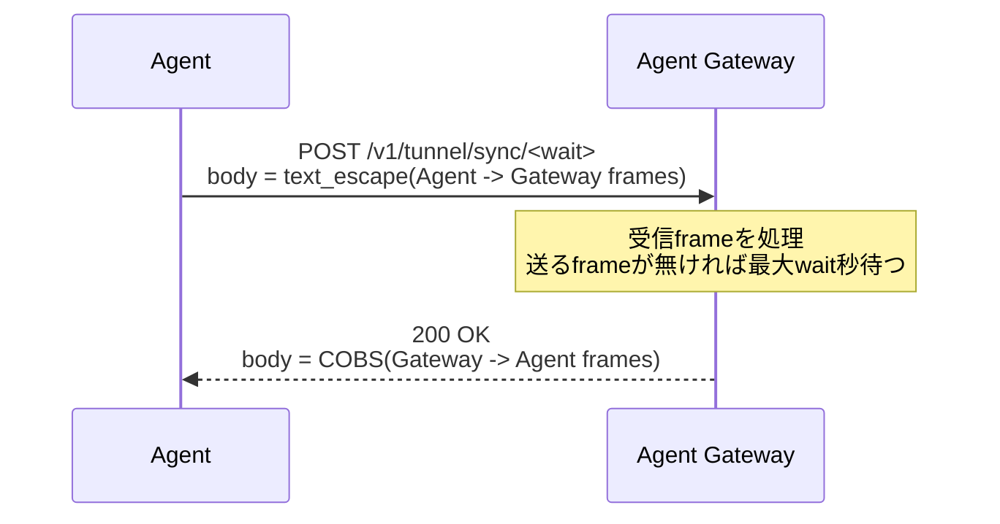
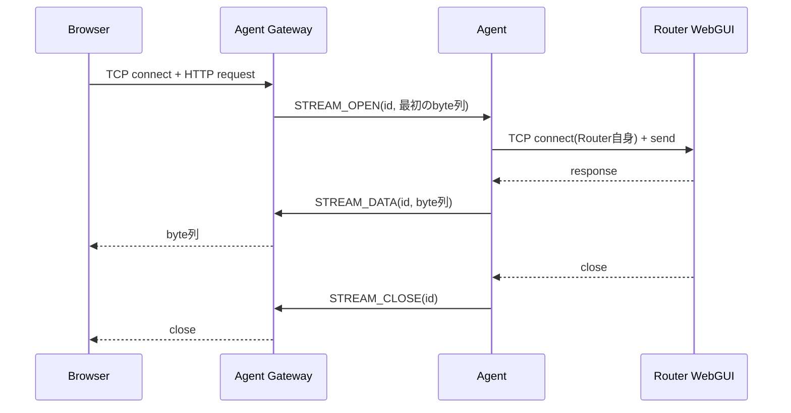

# Agent Protocol

Status: Current specification  
Scope: Core  
Last updated: 2026-09-15

Related:

- `docs/adr/0001-https-agent-transport.md`
- `docs/core/agent-gateway-design.md`
- `docs/core/lua-api-notes.md`(`rt.httprequest()`の実機制約)
- `docs/core/webgui-relay-design.md`
- Agent実装: `agent/https_tunnel_agent.lua`

## 1. Purpose

本ドキュメントは、YAMAHA Router上のLua AgentとAgent Gateway間の通信仕様(Agent Protocol)を定義する。deployment方式に依存しない。

Issue #4のRTX830実機PoCで検証し、ADR-0001で採用したHTTPS sync transportの挙動を正式化したものであり、新しいsemanticsは追加しない。PoCで決まっていない事項は§14に未決定事項として挙げる。

---

## 2. Status classification

各項目を以下のいずれかに分類する。

| 分類 | 意味 |
|---|---|
| Implemented and adopted | HTTPS PoCで実装し、RTX830実機で検証済み。採用済み |
| Adopted but not yet fully implemented | 採用済みだが、HTTPS PoCでは未実装または一部のみ実装 |
| Reserved / future | 番号・名前だけを予約している。payloadとsemanticsは未定義で、Public Protocolとして固定しない |

「PoC値」と記した数値は現行PoCの実装値であり、wire format上の要件ではない。正式実装時に調整してよい。

---

## 3. Transport

Status: Implemented and adopted

- Router側から開始するoutbound HTTPS / TCP 443だけを使う
- AgentはYAMAHA Luaの`rt.httprequest()`で通信する
- Agent GatewayのAgent endpointは、信頼された証明書でTLS終端する。`rt.httprequest()`はTLS証明書検証をskipできず、Cloudflare Workers / Tunnel系edgeへはTLS handshake_failureで接続できない(`docs/core/agent-gateway-design.md` §3)
- `rt.httprequest()`は呼び出しごとに接続を閉じるため、1回のsyncごとにTLS handshakeが発生する。Router CPUを抑えるため、往復回数を最小にする

protocol設計を拘束する`rt.httprequest()`の制約(`docs/core/lua-api-notes.md`):

- 任意のrequest headerを付けられない。認証はBearer(`Authorization` header)で行う
- `method='POST'`にはbodyが必須(bodyの無いPOSTは表現できない)
- `post_text`は一部の制御byteを受け付けない
- response bodyは0x00で切り捨てられる
- 呼び出しはblockingで、応答を受け取るまでAgentの処理が止まる

---

## 4. Sync endpoint

Status: Implemented and adopted

1回のHTTP request / responseで、Agent→GatewayのframeとGateway→Agentのframeを同時に交換する。



### 4.1 Request

```text
POST /v1/tunnel/sync/<wait>
Authorization: Bearer <device credential>
Content-Type: application/octet-stream

<text_escape(frame列)>
```

- `<wait>`: 10進整数(秒)。Gatewayは上限(PoC値: 25秒)で切り詰める
- body: 0個以上のframe(§5)を連結し、text_escape(§6.1)したもの
- 送るframeが無い場合は、HEARTBEAT frame 1つを送る(POSTにbodyが必須のため)
- `rt.httprequest()`の`timeout`は`wait`より長くする(PoC値: `wait + 10`秒)

### 4.2 Response

| Status | 条件 | Body |
|---|---|---|
| 200 | 正常 | Gateway→Agentのframe列を連結し、COBS(§6.2)したもの。frameが無い場合も200を返す |
| 400 | bodyのunescapeまたはframe解析に失敗 | 任意のtext |
| 401 | 認証失敗 | 任意のtext |
| 404 | 未定義のmethod / path | 任意のtext |
| 413 | request bodyが上限(既定: 2 MiB)を超える | 任意のtext |

- Gatewayはbody全体を解析してからframeを処理する。400を返す場合、そのbodyのframeは1つも処理しない
- 401の場合もbodyのframeを処理しない
- Agentは200以外を**sync失敗として扱い**、backoffして再試行する。`rt.httprequest()`の`rtn1`はHTTP errorでもtrueになるため、`code`で判定する(#22で決定、`docs/core/lua-api-notes.md`)
- 1回の応答に入れるframeの合計には上限があり(既定: 256 KiB)、超える分は次のsyncで返す。Agentの`rt.httprequest()`のbody上限(640 KB)とmemoryを超えないようにするため(#22で決定)

### 4.3 Wait semantics

Gateway:

- Agent宛のframeがある、または`wait = 0`の場合は、待たずに応答する
- Agent宛のframeが無く`wait > 0`の場合は、最初のframeが届くまで最大`wait`秒待つ
- 待機中に最初のframeが届いたら、短時間(PoC値: 30ms)だけ追加で待ち、Browserがほぼ同時に出す後続requestのframeを同じ応答にまとめる
- 応答時には、その時点でAgent宛に溜まっているframeをすべて返す

同一Deviceから同時に複数のsyncが来た場合、Gatewayは**古いsyncを空の応答で即座に返し**、最新のsyncだけがframeを受け取る(#22で決定)。Agentは同時に1つのsyncだけを実行するため(§4.4)、これは前のrequestが中断された場合に起きる。

Agent:

- active streamがある、または次に送るframeがある場合は`wait = 0`で即時に往復する
- それ以外(idle)は`wait`を長く取りlong-poll相当にする(PoC値: 20秒)

### 4.4 Agent loop

```text
loop:
  wait = (active streamまたは送信待ちframeがある) ? 0 : IDLE_WAIT
  sync(送信待ちframe, wait)
    成功 -> 応答frameを順に処理 -> 次に送るframeを集める
    失敗 -> 送信待ちframeを保持したままbackoffして再試行
```

- Agentは同時に1つのsyncだけを実行する
- 次に送るframeは、local socketから読めたデータを短時間集めてまとめる。1回のbodyが大きくなりすぎないよう上限を置く(PoC値: 64 KiBに達したら送る)
- sync失敗(`rt.httprequest()`の送信失敗またはLua error)時は、exponential backoff(PoC値: 1秒から倍々、最大30秒)で再試行し、成功したら初期値へ戻す

---

## 5. Frame format

Status: Implemented and adopted

```text
+---------+--------+-----------+-----------+
| Version | Type   | Stream ID | Length    |
| u8      | u8     | u16 BE    | u32 BE    |
+---------+--------+-----------+-----------+
| Payload (Length bytes)                    |
+-------------------------------------------+
```

- headerは8 byte、整数はbig-endian
- `Version`は`1`
- 1つのbodyには完結したframeだけを入れ、frameを複数のbodyへ分割しない
- 複数のframeは区切り文字なしで連結し、受信側は`Length`に従って先頭から順に切り出す
- body内のframeは先頭から順に処理する
- 受信側は未知の`Type`を無視する(Gatewayはlog出力して無視、Agentは何もしない)

### 5.1 Stream ID

- `0`はcontrol用(HEARTBEAT等、streamに属さないframe)
- `1`〜`65535`はlogical stream(WebGUI stream、Commandの対応付け等)
- WebGUI streamのIDはGatewayが割り当てる。`101`〜`65535`を循環して割り当て、u16の範囲を超えない
- **使用中のIDは再利用しない**。循環して一周した場合は、空いているIDまで進める(#22で決定)
- `1`〜`100`の用途は定めていない

---

## 6. Body encoding

Status: Implemented and adopted

frame列(§5)をHTTP bodyに載せる際、方向ごとに以下のencodingを行う。

### 6.1 Agent → Gateway: text_escape

`post_text`が受け付けないbyteと、escape byte `0xFF`自身を2 byteへ置き換える。

```text
Unsafe byte set U:
  0x00-0x08, 0x0B, 0x0C, 0x0E-0x1F, 0x7F   (post_textが拒否する値。RTX830で全256値を実測)
  0xFF                                      (escape byte)

encode: b ∈ U  -> 0xFF, (b XOR 0x40)
        b ∉ U  -> b
decode: 0xFF, x -> x XOR 0x40
```

- `0x09`(TAB)、`0x0A`(LF)、`0x0D`(CR)、`0x20`(space)はescapeしない
- `b XOR 0x40`の結果は必ずUに含まれない
- bodyの末尾が単独の`0xFF`で終わる場合はmalformedとする(Gatewayは400を返す)
- WebGUIのHTML / CSS / JavaScriptでのサイズ増加は実測で約2%

### 6.2 Gateway → Agent: COBS

response bodyは0x00で切り捨てられるため、frame列全体をCOBS(Consistent Overhead Byte Stuffing)でencodeする。

- body全体を1つのCOBS列とし、末尾に区切りの`0x00`は付けない
- encode結果は`0x00`を含まない
- 空のframe列は`0x01`(1 byte)になる
- decode: code byte `c`を読み、続く`c - 1` byteをそのまま出力する。`c < 0xFF`かつ入力の末尾でなければ、続けて`0x00`を1 byte出力する

test vector:

| 入力 | COBS |
|---|---|
| (空) | `01` |
| `00` | `01 01` |
| `00 00` | `01 01 01` |
| `00 11 00` | `01 02 11 01` |

---

## 7. Frame types

| Type | Name | 方向 | Stream ID | Payload | Status |
|---|---|---|---|---|---|
| `0x01` | AUTH | - | - | - | Reserved / future |
| `0x02` | AUTH_OK | - | - | - | Reserved / future |
| `0x03` | HEARTBEAT | Agent→Gateway | `0` | 空 | Implemented and adopted |
| `0x10` | COMMAND_REQUEST | Gateway→Agent | 対応付け用ID | command文字列 | Implemented and adopted |
| `0x11` | COMMAND_RESPONSE | Agent→Gateway | requestと同じID | 結果1 byte + 出力 | Implemented and adopted |
| `0x20` | STREAM_OPEN | Gateway→Agent | stream ID | 最初に送るbyte列 | Implemented and adopted |
| `0x21` | STREAM_DATA | 双方向 | stream ID | byte列 | Implemented and adopted |
| `0x22` | STREAM_CLOSE | 双方向 | stream ID | 空 | Implemented and adopted |
| `0x23` | STREAM_ERROR | Agent→Gateway | stream ID | 理由(text) | Adopted but not yet fully implemented |
| `0x30` | TELEMETRY | - | - | - | Reserved / future |
| `0x31` | EVENT | - | - | - | Reserved / future |
| `0x32` | SYSLOG | Agent→Gateway | `0` | LF区切りの生のSYSLOG行 | Implemented and adopted |
| `0x33` | SYSLOG_LIVE | Gateway→Agent | `0` | 1 byte(`1` = Live mode on、`0` = off) | Implemented and adopted |
| `0x40` | CONFIG_BACKUP | Agent→Gateway | `0` | reason + LF + 生のCONFIG本文 | Implemented and adopted |
| `0x41` | CONFIG_REQUEST | Gateway→Agent | `0` | reason(text) | Implemented and adopted |
| `0x42` | UPDATE_AVAILABLE | Gateway→Agent | `0` | 導入すべきversion(text) | Implemented and adopted |
| `0x43` | AGENT_STATUS | Agent→Gateway | `0` | version / slot / rollback(LF区切り) | Implemented and adopted |
| `0x44` | CONFIG_APPLY_BEGIN | Gateway→Agent | Apply stream | operation_id + total_bytes + chunk_bytes + target_sha256 | Adopted but not yet fully implemented |
| `0x45` | CONFIG_APPLY_CHUNK | Gateway→Agent | Apply stream | seq + raw CONFIG bytes | Adopted but not yet fully implemented |
| `0x46` | CONFIG_APPLY_END | Gateway→Agent | Apply stream | total_bytes + chunk_count | Adopted but not yet fully implemented |
| `0x47` | CONFIG_APPLY_ACTIVATE | Gateway→Agent | Apply stream | 空 | Adopted but not yet fully implemented |
| `0x48` | CONFIG_APPLY_RESULT | Agent→Gateway | Apply stream | status + seq + error_code | Adopted but not yet fully implemented |
| `0x49` | CONFIG_APPLY_ABORT | Gateway→Agent | Apply stream | 空 | Adopted but not yet fully implemented |
| `0x4A` | GATEWAY_ENDPOINTS | Gateway→Agent | `0` | Gatewayのendpoint URL(LF区切り) | Implemented(RTX830実機確認、#147) |

### 7.1 AUTH / AUTH_OK

HTTPS transportでは、認証をHTTPの`Authorization` headerで行う(§9)。AUTH / AUTH_OK frameは使用しない。番号だけを予約する。

### 7.2 HEARTBEAT

Agentが送るframeが無い場合にsync bodyとして送る。Gatewayは受信しても何もしない。生存確認はHEARTBEATに限らず、認証済みのsync全体で行う(§10)。

### 7.3 COMMAND_REQUEST / COMMAND_RESPONSE

YAMAHA CLI commandを`rt.command()`で実行する。

- COMMAND_REQUEST payload: command文字列(`rt.command()`の上限は4095文字)
- COMMAND_RESPONSE payload: 先頭1 byteが結果(`0x01` = 成功、`0x00` = 失敗)、続けて`rt.command()`の出力
- COMMAND_RESPONSEはCOMMAND_REQUESTと同じStream IDで返す
- 出力はShift_JISで、CR / LFを含む(`docs/core/lua-api-notes.md`)

Command IDはStream IDと同じID空間から割り当て、使用中のIDは再利用しない(#25で決定)。

**timeoutしたCOMMAND_REQUESTは再送しない**。sync失敗時の再送で二重実行になることを避けるため、応答が来なかったcommandは失敗として扱い、再実行の判断は利用者に委ねる(§11、#25で決定)。timeout後に届いたCOMMAND_RESPONSEは捨てる。

RTX830実機で、HTTPS transport上でのcommand実行と日本語(Shift_JIS)を含む出力の取得を確認済み(#25)。

### 7.4 STREAM_*

WebGUI relay用のstream(§8)。STREAM_ERRORは、AgentがSTREAM_OPENでlocal WebGUIへの接続に失敗した場合に理由をtextで返すframeで、raw TCP Agent(`agent/mux_agent.lua`)は送るが、HTTPS Agentは送らず、どちらのGatewayも処理しない(§14)。

### 7.5 SYSLOG / SYSLOG_LIVE

Raw SYSLOGは既存のsyncへpiggybackする(`docs/core/syslog-design.md` §4)。

- SYSLOG payloadは**LF(`0x0A`)区切りの生の行**。Router出力のためShift_JISを含みうる(Server側でデコードする)。Stream IDは`0`
- 1 batchの行数・byte数はAgent側の上限に従い、溢れた分は古い行から捨てて、捨てた件数を1行として送る
- SYSLOG_LIVEはGatewayからAgentへLive modeを指示する。Live中はAgentのflush周期を短くする(§4.2)。Agent再接続時はoffに戻るため、購読者が居ればGatewayが再通知する

### 7.6 CONFIG_BACKUP / CONFIG_REQUEST

CONFIG snapshotの取得(#6)。Agentは本文を解釈しない。

- CONFIG_BACKUP payload: `reason`(ASCII) + LF(`0x0A`) + `show config`の出力そのまま(Shift_JIS)
- `reason`: `agent_start` / `config_changed` / `manual` / `periodic_reconcile` /
  `pre_apply` / `apply_verify` / `checkpoint`。
  知らない値を受け取った場合、Gatewayは`manual`として扱いsnapshot自体は捨てない
- CONFIG_REQUEST payloadは要求時の`reason`。Agentは次のsyncでCONFIG_BACKUPを返す
- Agentは起動時に1回CONFIG_BACKUPを送る
- device_id / model / firmware / agent versionはGatewayが持っているためpayloadへ入れない
- Server側はsize検証 -> hash / dedupe -> parse -> Device Profile更新の順に処理する。
  `show config`は取得のたびに`# Reporting Date:`が変わるため、同一判定ではこの行を除く
  (RTX830実機で確認)
- CONFIG本文はsecretを含む前提で扱い、log・error responseへ出さない
  (`docs/core/config-backup-design.md` §7)

### 7.7 CONFIG_APPLY_*

CONFIG Restore(#62)の転送に使うApply専用stream。CONFIG本文をCOMMAND_REQUESTのcommand文字列へ埋め込まず、raw byte列として扱う。

- CONFIG_APPLY_BEGIN payloadは次の固定長54 byte。整数はbig-endian。
  `operation_id(16 byte)` / `total_bytes(u32)` / `chunk_bytes(u16)` /
  `target_sha256(32 byte)`
- `chunk_bytes`は1〜32,764 byte。CONFIG_APPLY_CHUNK payloadは
  `seq(u32)` + raw CONFIG bytesで、`seq`を含むpayload全体を32 KiB以下にする。
  raw CONFIG bytesは空にできない。
- CONFIG_APPLY_CHUNKの`seq`は0から始まる連番であり、欠落・重複・順序入れ替えを受け付けない。
  1 frameを複数HTTP responseへ分割せず、CHUNK列自体は複数responseにまたがってよい。
- CONFIG_APPLY_END payloadは`total_bytes(u32)` + `chunk_count(u32)`。受信したbyte数とchunk数、BEGINの`total_bytes`を照合してからstaging完了とする。
- CONFIG_APPLY_ACTIVATEとCONFIG_APPLY_ABORTのpayloadは空。ACTIVATEはstaged fileに対する一方向の境界であり、応答未受信時に自動再送しない。
- CONFIG_APPLY_RESULT payloadは`status(u8)` + `seq(u32)` + `error_code(u8)`の6 byte。
  `seq = 0xFFFFFFFF`はchunkに紐付かない結果を表す。

statusのwire codeは次のとおり。

| code | status |
|---:|---|
| `0x01` | `ready` |
| `0x02` | `chunk_ack` |
| `0x03` | `staged` |
| `0x04` | `loaded` |
| `0x05` | `write_failed` |
| `0x06` | `load_failed` |
| `0x07` | `busy` |
| `0x08` | `invalid` |

error codeのwire codeは`none(0x00)`、`invalid_payload(0x01)`、
`invalid_sequence(0x02)`、`chunk_too_large(0x03)`、
`byte_count_mismatch(0x04)`、`chunk_count_mismatch(0x05)`、
`busy(0x06)`、`file_open_failed(0x07)`、`file_write_failed(0x08)`、
`file_close_failed(0x09)`、`load_failed(0x0A)`、`not_staged(0x0B)`、
`already_activated(0x0C)`、`aborted(0x0D)`、`unknown(0xFF)`とする。

### 7.8 UPDATE_AVAILABLE / AGENT_STATUS

Agent A/B Update(#35、`docs/core/agent-update-design.md`)。

- AGENT_STATUS payload: `version` / `slot` / `rollback:<reason>`(LF区切り、3行目以降は任意)。
  rollback時は`<version> <reason>`、両slot recovery時は`recovered_both_slots_invalid`を載せる。
  Agentは起動時に1回送る。slotと理由はSupervisorのstate fileから読むだけで、Agentは解釈しない。
  Agent 0.3.0以上は、Supervisor自身の更新(#159)のために、次の行も載せる: `supervisor:<version>`
  (動いているSupervisorのversion)、`supervisor_rollback:<version> <reason>`(Supervisor自身の更新を
  直前に戻した理由。Supervisor(1.1.0以上)がloaderのstateから取る)
- UPDATE_AVAILABLE payload: 導入すべきversion。AgentはSupervisorへ更新要求を渡すだけで、
  downloadと検証・切り替え・rollbackはSupervisorが行う
  payloadが`supervisor-<version>`のときは、Supervisor自身の更新(#159、`docs/core/agent-update-design.md` §11)の
  依頼で、Agentは同じく更新要求をSupervisorへ渡す。Agent versionとは別に、Serverは望ましいSupervisor versionを
  保存し(Admin APIの`POST /api/devices/:id/supervisor-version`)、接続中なら通知し、報告された
  `supervisor:`のversionと違えば、AGENT_STATUSのたびに通知する。直前に戻したversionは再通知しない
- Gatewayは、報告されたversionがdesired versionと違う場合にUPDATE_AVAILABLEを送る。
  ただし**直前にrollbackしたversionは再通知しない**(同じcandidateを入れ直し続ける
  ループになる。RTX830実機で確認)。recovery結果はrollback versionとして扱わず、再通知を抑制しない。
  再試行はAdminの明示指定で行う

### 7.9 TELEMETRY / EVENT

番号だけを予約している。payloadとsemanticsは各機能のIssueで定義する。

---

### 7.10 GATEWAY_ENDPOINTS

Agentが接続するGatewayのendpoint一覧を、Gatewayから更新する(#147)。ドメインの変更や、Gatewayを別のVPSへ移すときに、Routerを再Enrollmentせずに接続先を切り替えるためのframe。

- payload: endpoint URL(ASCII、LF区切り)。先頭が現在の接続先で、2つ目以降は将来のfailover用(最大4つ)
- 各URLは`http(s)://host[:port][/path]`で、末尾に`/`を付けない。長さは200文字以内(RTX830の`rt.httprequest()`のURL上限255文字から、`/v1/tunnel/sync/<wait>`の分を引いた値)。**不正な行が1つでもあれば、一覧全体を捨てる**
- 送るのは、AGENT_STATUSで報告されたAgent versionが`0.2.0`以上のときだけ。未知のframeは古いAgent(0.1.x)が無視して動き続けることを、RTX830実機で確認した。Gatewayは、AGENT_STATUSを受けたときと、Deviceのpresenceがonlineになったとき(Gatewayの再起動後など)に送る。一覧が現在と同じなら、Agentは何もしない
- Agentは受け取った一覧を`/routemon_gateways.dat`(Luaのtable)へ、一時fileへ書いてからrenameで保存する。`routemon_device.conf`(token入り)は書き換えない。fileが無ければdevice configの`gateway`を使う。Supervisorも同じfileを読み、Agent取得とrecoveryの接続先に使う
- Communityは、`AGENT_ENDPOINTS`(カンマ区切り)の一覧を送る。既定は`AGENT_BASE_URL`。接続先を変えるときは、古い接続先がまだ使えるうちに、この値を新しい接続先へ変える

**誤った接続先への切り替えを戻す(安全装置):** 切り替えた直後は「未確定」とし、元の一覧を`/routemon_gateways.prev`に、確定しないまま起動した回数とあわせて残す。

- 切り替えた接続先で最初のsyncが成功したら確定する(`.prev`を消す)。切り替えを知らせたsync自体は古い接続先のものなので、確定には数えない
- 確定する前に、syncが連続で6回失敗したら、元の一覧へ戻す
- 確定しないまま、Agentが3回起動(再起動を含む)したら、元の一覧へ戻す。Agentが落ちて再起動されても、戻る情報が消えない
- RTX830実機で、到達できない接続先を送ったとき、約2〜3分後に元の接続先へ戻ることを確認した

## 8. WebGUI stream semantics

Status: Implemented and adopted



- GatewayはBrowserの接続ごとにStream IDを割り当て、最初に読めたbyte列(PoC値: 最大4096 byte)をSTREAM_OPENで送る
- AgentはSTREAM_OPENを受けると、Agent側で固定したRouter自身のWebGUI address(`docs/core/webgui-relay-design.md` §4)へTCP接続し、payloadを送る
- STREAM_DATAは生のbyte列を運ぶ。HTTPを解釈しない(PoC値: Agentは1回の読み取りで最大8192 byte、Gatewayは最大4096 byte)
- STREAM_CLOSEは双方向で送る。送った側・受けた側ともにそのstreamの状態を破棄する
  - Agent: local WebGUI socketが閉じた / errorになった場合、またはデータが一定時間無い場合(PoC値: 5秒)に送る
  - Gateway: Browserが接続を閉じた場合に送る(既にAgentからSTREAM_CLOSEを受けたstreamには送らない)
- 未知のStream ID宛のSTREAM_DATA / STREAM_CLOSEは無視する
- YAMAHA WebGUIはHTTP/1.0で応答し、毎回自分から接続を閉じる。1つのstreamはおおむね1つのHTTP requestに対応する
- `/define.js`の書き換え等のL7補正と、session作成時の認可はprotocolの範囲外であり、`docs/core/webgui-relay-design.md`に従う

---

## 9. Authentication

- すべてのsync requestに`Authorization: Bearer <credential>`を付ける(`rt.httprequest()`の`auth_type = 'bearer'`)。Status: Implemented and adopted
- Gatewayは認証に失敗したrequestを401で拒否し、bodyのframeを処理しない。Status: Implemented and adopted
- credentialはDeviceごとに発行し、revoke可能にする。PoCは全Agent共通の1つのtokenを使っている。Status: Adopted but not yet fully implemented(発行は#23、検証は#22)
- Agentは`tenant_id`を送らない。Device -> TenantはGateway / Server側で解決する(`docs/core/agent-gateway-design.md` §4)

---

## 10. Liveness and reconnect

Status: Implemented and adopted

- idle時もAgentはlong-poll(§4.3)を繰り返すため、Gatewayは少なくとも約`IDLE_WAIT`秒ごとに認証済みsyncを受ける
- 生存確認には、HEARTBEATだけでなく認証済みのsync全体を使える(`docs/core/data-model.md` §5)
- Derived statusのtimeoutは、最後に観測してからの経過時間で判定する(#22で決定、いずれも設定値)

```text
45秒以内   -> Online
120秒以内  -> Unstable
それ以降   -> Offline
観測なし   -> Unknown(Gateway再起動直後を含む)
```

idle時のsyncは約20秒ごとに届くため、Onlineのしきい値はその2倍強を既定とする。syncが来ないDeviceはsyncを契機に判定できないため、Gatewayは定期的に再判定する
- sync失敗時、Agentはexponential backoffで再試行する(§4.4)。RTX830実機でGateway再起動後の自動復帰を確認済み

---

## 11. Delivery semantics

Status: Implemented and adopted(現行PoCの挙動)

frame単位のack / 再送は無い。

- Agent → Gateway: sync失敗時、Agentは同じframe列を次のsyncで再送する。Gatewayが処理した後に応答だけが失われた場合、frameは重複して届く
- Gateway → Agent: Gatewayは応答に入れた時点でframeを送信queueから外す。応答が失われた場合、そのframeは失われる

WebGUI streamでは、欠落・重複が起きた場合にBrowser側の再読み込みで回復する前提としている。Command / CONFIG等で重複・欠落を許容できない場合の扱いは§14。

---

## 12. Limits

| 項目 | 値 | 根拠 |
|---|---|---|
| `<wait>`の上限 | 25秒 | PoC値(Gateway) |
| idle時の`wait` | 20秒 | PoC値(Agent) |
| request body上限 | 2 MiB | 既定値(Gateway) |
| 1回の応答に入れるframeの合計 | 256 KiB | 既定値(Gateway) |
| Agentが受け取らない間に溜めるframeの上限 | 4 MiB(超えたらそのDeviceのstreamを閉じる) | 既定値(Gateway) |
| Agentが1回のsyncで送るframe列 | 64 KiBに達したら送る | PoC値(Agent) |
| `rt.httprequest()`のURL長 | 最大255文字 | RTX830の制約 |
| `rt.httprequest()`のbody | 最大640 KB | RTX830の制約 |
| `rt.httprequest()`のtimeout | 1〜180秒 | RTX830の制約 |
| `rt.command()`のcommand長 | 最大4095文字 | RTX830の制約 |

応答サイズの上限を超える分は次のsyncで返す(§4.2)。

---

## 13. Other Agent endpoints

Status: Adopted but not yet fully implemented

sync以外に、同じpublic Agent endpointで以下を提供する。Agent API以外の管理endpointは同じlistenerへ露出しない(`docs/core/agent-gateway-design.md` §3)。

| Endpoint | 用途 | 認証 | 定義 |
|---|---|---|---|
| `GET /v1/enrollment/bootstrap` | Enrollment時のBootstrap取得 | Bearer Enrollment Code | `docs/core/device-enrollment-design.md` §5 |
| `GET /v1/agent/releases/{version}` | Agent artifact取得 | Bearer Device credential | `docs/core/agent-update-design.md` §4 |
| `GET /v1/agent/releases/{version}/manifest` | Release manifest取得 | Bearer Device credential | `docs/core/agent-update-design.md` §4 |

---

## 14. Open items

PoCで決まっていないため、本仕様では定めない事項。

| # | 事項 | 現行の挙動 | 決めるIssue |
|---|---|---|---|
| 1 | STREAM_OPENでlocal WebGUIへ接続できなかった場合の通知 | HTTPS Agentは何も返さない(raw TCP AgentはSTREAM_ERROR `0x23`を送る)。Gateway側はSTREAM_ERRORを受け取ればstreamをcloseし、Browserの接続も閉じる(#22・#27で実装済み)。Agent側の送信は#35のAgent本実装で入れる | #35 |
| 2 | frame単位のack / 再送 / 重複排除(Command、CONFIG等) | 無い(§11) | #25、#6 |
| 3 | `Version`が`1`以外のframeを受けた場合の扱い、Agent / Gateway間のversion互換 | 受信側は`Version`を検証していない | 未定 |
| 4 | TELEMETRY / EVENTのframe定義 | 未実装(SYSLOGは#26、CONFIGは#6で定義済み) | 未定 |


#35で決定し本文へ反映した事項: UPDATE_AVAILABLE / AGENT_STATUSのpayloadと再通知の抑制(§7.7)。

#6で決定し本文へ反映した事項: CONFIG_BACKUP / CONFIG_REQUESTのpayloadとreason(§7.6)。

#22で決定し本文へ反映した事項: 200以外の応答の扱い(§4.2)、応答サイズの上限(§4.2、§12)、使用中のStream IDを再利用しない規則(§5.1)、同一Deviceの複数syncの扱い(§4.3)、Presenceのtimeout(§10)。

---

## 15. Raw TCP baseline

Status: Retained as baseline(標準transportではない)

同じframe format(§5)を、永続TCP接続上でescape / COBSなしに運ぶ。開発・診断・性能比較用として保持する(ADR-0001)。

- 初期のPoC実装(raw TCP版)は、この公開repositoryには含めない
- TCPには認証も暗号化も無い
- Gatewayは接続断を検知するため、HEARTBEATを定期的に送る(PoC値: 15秒)
