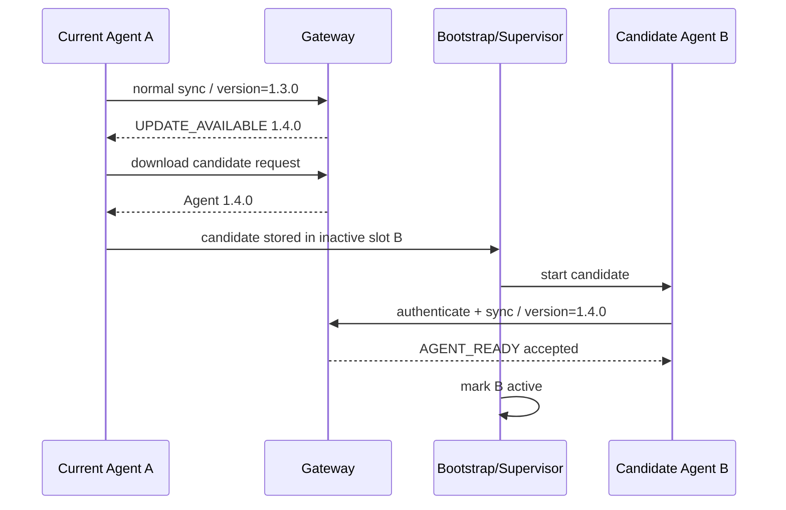

# Agent Update and Recovery Design

Status: Current specification (Initial design)  
Scope: Core  
Last updated: 2026-09-27

## 1. Purpose

本ドキュメントは、YAMAHA Router上のRoutemon Agentを安全に更新し、更新失敗時に自動復旧する仕組みを定義する。

重要な原則は、**現在正常に動いているAgentを直接上書きしないこと**、および**壊れたAgent自身だけに復旧責任を持たせないこと**である。

---

## 2. Component split

Router側を以下の要素に分離する。

```text
YAMAHA Router
├── routemon_bootstrap.lua        固定のローダー(schedule atが起動する、#159)
├── routemon_supervisor_a.lua     Supervisor slot a
├── routemon_supervisor_b.lua     Supervisor slot b(更新の候補、無いこともある)
├── routemon_sup.dat              ローダーのstate(active slot、候補、起動回数)
├── routemon_device.conf
├── routemon_agent_a.lua
├── routemon_agent_b.lua
├── routemon_syslog_watcher.lua
└── routemon_state.dat
```

### loader(`/routemon_bootstrap.lua`)

`schedule at`が起動するpathに置く、小さな**固定**のloader(`agent/update/routemon_loader.lua`、#159)。Supervisorを、同じLua taskの中で`pcall`して動かす。Supervisorのためのtaskは増えない。責務は、Supervisor slotの選択、Supervisorの見張り、Supervisor自身の更新の確定と復帰(§11)。自身は更新しない。

### supervisor

小さく、極力変更しない安定層。Supervisor slot(`/routemon_supervisor_a.lua` / `_b.lua`)のどちらかとして、loaderの中で動く。

責務:

- Device設定読込
- active Agent slot判定
- Agent起動
- SYSLOG watcher taskの起動と生存監視
- candidate Agentの起動確認
- 更新失敗時のfallback
- Agentが両slotとも利用不能な場合のrecovery開始

CONFIG解析、SYSLOG解析、Device Profile生成等は持たせない。

### SYSLOG watcher

`routemon_syslog_watcher.lua`はAgentのA/B releaseとは別の固定ファイルとする。
Enrollment Bootstrapが初回配置し、Supervisorがtaskの起動・生存監視・再起動を行う。
そのためAgentの更新でwatcherをinactive slotへ書き込んだり、active slotと一緒に切り替えたりしない。

### device config

Device固有情報をAgent sourceから分離する。

例:

```text
device_id
primary_gateway
device_token
update_channel
```

Agent Lua本体へDevice Tokenを埋め込まない。

### Agent A/B slots

本体AgentをA/B 2 slotで保持する。

```text
A = current stable
B = inactive / candidate
```

更新時はinactive slotへ新Agentを書き込み、正常性確認後にactive slotを切り替える。

---

## 3. Why A/B

単一Agent fileを直接上書きすると、以下の障害で管理不能になる可能性がある。

```text
download途中で回線断
file write失敗
syntax error
runtime error
新AgentがGatewayへ接続できない
```

A/B方式ではcurrent stableを保持したままcandidateを導入できる。

```text
Stable A running
  ↓
Download candidate to B
  ↓
Validate / start B
  ├── success -> B active
  └── failure -> Aを継続/復帰
```

---

## 4. Release distribution

Agent ReleaseはServer側で管理し、RouterはCurrent Gatewayのpublic HTTPS endpointから取得する。

RTX830からCloudflare Edgeへ直接TLS terminationできない既知の制約があるため、Agent artifact取得もGateway経由を基本とする。

例:

```text
Server / Artifact storage
        ↓
Routemon Gateway
        ↓ HTTPS
YAMAHA Router
```

Gateway endpoint例:

```text
GET /v1/agent/releases/{version}
GET /v1/agent/releases/{version}/manifest
```

Device Token等で認証する。

`stable`はEnrollmentと両slot recoveryで使うrelease aliasで、release directoryの`stable.lua`を配布する。
Agentはsource内で`local VERSION = 'x.y.z'`を宣言し、stableのmanifestはこの実versionを`version`として返す。
Agentが起動時に報告する版とmanifestを一致させるため、`stable.lua`を差し替えるときはartifactの版宣言も更新する。
個別versionのrelease fileは`<version>.lua`として置き、管理画面の更新対象にはstable aliasを含めない。

---

## 5. Release manifest

Release metadataには最低限以下を持つ。

```text
version
artifact_name
size
content_hash
release_channel
minimum_bootstrap_version
created_at
```

例:

```json
{
  "version": "1.4.0",
  "artifact_name": "routemon-agent-1.4.0.lua",
  "size": 102400,
  "content_hash": "...",
  "release_channel": "stable",
  "minimum_bootstrap_version": "1.0.0"
}
```

Router側で使用可能なhash verification手段はPoCで確認する。

Router側hash検証を安全かつ軽量に実装できない場合でも、Gateway/Artifact側でhash検証し、HTTPS/TLS、Content-Length、syntax/basic validation、post-start health checkを組み合わせる。

Release manifestの`version`はAgentが報告する実versionを返す。`stable`への要求ではGatewayが`stable.lua`内の`local VERSION`宣言から版を解決する。Enrollmentはこのmanifestを読み、`routemon_device.conf`には再取得用のrelease名を、`routemon_state.dat`には実versionを書く。Supervisorはrelease aliasを取得するときmanifestの版をcandidate versionとして使う。

---

## 6. Update availability

Agentは通常syncで自身のVersionを報告する。

```text
agent_version = 1.3.0
update_channel = stable
```

Server/Gatewayはdesired versionとの差を判定する。

必要な場合のみ、通常sync responseで更新通知を返す。

```text
UPDATE_AVAILABLE
version = 1.4.0
```

更新確認用の専用常時Pollingは追加しない。

実装(#35、`docs/core/agent-protocol.md` §7.7):

- Agentは起動時に`0x43 AGENT_STATUS`でversion / slot / 直前のrollback理由を報告する
- Gatewayはdesired versionと違えば`0x42 UPDATE_AVAILABLE`を返す
- **直前にrollbackしたversionは再通知しない**。同じcandidateを入れ直し続けるループになる
  (RTX830実機で確認)。再試行はAdminがversionを指定し直したときだけ行う
- AgentはUPDATE_AVAILABLEを受けても自分では何もせず、更新要求fileを書いてSupervisorへ渡す

---

## 7. Update flow



実装詳細によってはcurrent AgentではなくSupervisorがdownload処理を担当してもよい。

重要なのは、current stable fileをcandidate検証前に破壊しないことである。

---

## 8. Success criteria

新Agentのupdate成功条件は、Lua fileを書き込めたことだけではない。

最低限以下を満たして成功とする。

```text
1. Candidate file取得完了
2. size/basic validation成功
3. Luaとして起動可能
4. Device identity読込成功
5. Gatewayへ認証成功
6. normal sync成功
7. candidate versionが期待値と一致
```

GatewayとのAuthenticated syncまで完了したことをhealth checkとする。

---

## 9. Rollback

Candidateが一定時間内に正常syncできない場合は旧slotへ戻す。

```text
B start
  ↓
health check timeout / crash / auth failure
  ↓
B failed
  ↓
active = A
  ↓
A restart/continue
  ↓
UPDATE_ROLLBACK event
```

Rollback reasonはServer側へ通知する。

例:

```text
syntax_error
startup_timeout
gateway_auth_failed
sync_failed
version_mismatch
unknown
```

exact timeout/retry値は実機PoCで決定する。

---

## 10. Recovery when both slots fail

active slotとinactive slotの両方で`loadfile`が失敗した場合、Supervisorはrecovery modeへ入る。
`/routemon_device.conf`を読めない場合は認証情報が無いため復旧できず、Gatewayへ接続しない。

Supervisorの接続先は、Agentが更新した接続先の一覧`/routemon_gateways.dat`(`docs/core/agent-protocol.md` §7.10)があればその先頭を使い、無ければdevice configの`gateway`を使う。Gateway移行後も、Agent取得とrecoveryが新しい接続先へ向かう。

Recovery手順:

1. Device Tokenで`stable/manifest`を取得し、実version、size、content hashを読む。
2. `stable` artifactを一時fileへ保存し、size、SHA-256 moduleがあればhash、`loadfile`構文を確認する。
3. 検証済みfileをslot aへ移し、stateを`active=a`とmanifestの実versionで保存する。
4. Agentをcandidateとして起動し、通常更新と同じく最初の認証済みsyncがhealth fileへ実versionを書いたことを確認する。確認できたらrecovery状態を解除する。
5. Agentの`AGENT_STATUS`に直前理由`recovered_both_slots_invalid`を載せ、ServerはDevice詳細に復旧結果を記録する。

manifest取得・artifact取得・検証に失敗した場合と、起動後90秒以内にhealth fileが書かれない場合は、5分待ってstable取得から再試行する。Supervisor再起動後にrecovery candidateが残っていれば同じcandidateを起動してhealth確認を続ける。

---

## 11. Supervisor update

Supervisor自身の更新(#159、ADR-0008 §10)は、Agentの更新とは分離し、固定のloaderで行う。

```text
Server-side logic
  最も頻繁に変更可能

Agent
  必要時のみ更新

Supervisor
  滅多に更新しない。更新できる(loaderが復帰を保証する)

Loader
  固定。更新しない
```

更新できない場合は、バグ修正が再Enrollmentになる、Release署名の検証を後から足せない、manifest / Release APIの互換性を古いSupervisorに合わせ続ける必要がある、接続先やRouterファームウェアの変更に追随できない、という問題がある。

### 11.1 構成

- `/routemon_bootstrap.lua`(`schedule at`が起動するpath)は、固定のloader(`routemon_loader.lua`)。Routerの設定(`schedule at`)を変えずに済む
- Supervisorは、`/routemon_supervisor_a.lua` / `_b.lua`の2 slot。active(確定済み)と、候補
- loaderは`/routemon_sup.dat`に、`active`、`candidate`、`candidate_version`、`starts`(確定しないまま候補を起動した回数)、`last_rollback`を持つ。一時fileへ書いてからrenameで置き換える
- Enrollmentは、現行のSupervisorをslot aへ、loaderを`/routemon_bootstrap.lua`へ配置し、stateを初期化する(slot aをactiveにし、候補とslot bを消す)

### 11.2 更新の手順

0. Adminが、望ましいSupervisor versionを設定する(`POST /api/devices/:id/supervisor-version`)。Serverは保存し、接続中ならすぐに、そうでなければ、次のAGENT_STATUSで報告された`supervisor:`のversionと違うときに通知する(Agent 0.3.0以上、Supervisor 1.1.0以上が報告する)。直前に戻したversionは再通知せず(`supervisor_rollback:`)、`supervisor.rollback`のEventとして1度だけ記録する
1. Serverが、`UPDATE_AVAILABLE`に`supervisor-<version>`を載せて通知する。AgentがSupervisorへ渡す(Agent updateと同じ`/routemon_update.req`)。artifactは、release dirの`supervisor-<version>.lua`で、Agent updateと同じRelease API(`GET /v1/agent/releases/supervisor-<version>[/manifest]`)で配る。Agentのrelease一覧には含めない
2. Supervisorが、非アクティブなslotへdownloadし、size、hash、構文を検証する(Agent updateと同じ手順)。失敗したら更新を拒否し、現行のまま動き続ける
3. Supervisorがloaderへcandidateとしてstageしてからreturnするとloaderがすぐに候補を起動する(`starts`を数える)。候補は起動時に、Agent taskを止めて起動し直す
4. 候補が、**Agentが認証済みsyncに成功している状態で、120秒間動き続けたら確定**する(`active`を切り替え、`candidate`を消す)

### 11.3 復帰

| 状況 | loaderの動き |
|---|---|
| 候補が起動中にLuaのエラーで落ちる、または確定する前に終わる | 即座に旧slotへ戻し、待たずに旧slotで再起動する |
| 候補の構文エラー(slotが読めない) | 旧slotへ戻す |
| 候補が確定できないまま、600秒を過ぎる | 候補自身が`rollback`を呼び、旧slotで再起動する |
| 候補が確定しないまま、再起動(Router reboot等)を繰り返し、起動が3回を超える | 旧slotへ戻す |
| activeのSupervisorがLuaのエラーで落ちる | 10秒後に再起動する(見張り) |
| activeのslotが読めず、もう一方が読める | もう一方へ切り替える |
| 更新のdownload中に電源が落ちる | stateは変わらない(downloadは一時fileへ書き、検証してから置く)。再起動後、現行のSupervisorが動く |

### 11.4 RTX830実機での確認(#159)

- 更新の成功: 更新要求から約26秒でdownloadとhash検証(17,281 bytes)、候補を起動、約2分後に確定した
- 構文エラーのartifact: 拒否され、現行のまま動き続けた
- 起動時にLuaのエラーで落ちる候補: 同じ秒のうちに旧slotへ戻った
- 確定しない候補: 150秒後に自分で戻り、同じ秒のうちに旧slotで再起動した
- **Routerの再起動をまたいで確定しない候補**: 確定しない候補(`SUP_CONFIRM_*`を無期限にしたもの)を置いたまま、RouterをAPIから`save`せずに3回再起動した。1回目と2回目の再起動後は、loaderが`schedule at`で自動起動し、候補を再び起動した(`starts`が2、3と、再起動をまたいで増えた)。**3回目の再起動後(起動が3回を超えたとき)は、loaderが旧slotへ戻し**、`last_rollback`に`<version> unconfirmed after 3 starts`が残り、Serverにも`supervisor.rollback`のEventが記録された。再起動から、Agentがonlineに戻るまで、約75〜85秒
- loaderの他のscenario(上記の表の、activeの切り替え、通常の終了・エラーでの待ち時間など)は、パスを置き換えたLuaの疑似環境で確認した
- SHA-256は、約17KBで26秒(約0.7KB/秒)かかる。この間、ルーターのCPUは高くなるが、LANの応答とAgentのsyncに影響しなかった(`docs/core/agent-update-design.md` §17.5、#159の測定)

---

## 12. Rollout control

全Deviceへ同時配布しない。

Release channel候補:

```text
stable
beta
```

段階展開例:

```text
1. 開発/検証Device
2. 数台のcanary
3. 10%
4. 50%
5. 100%
```

Deviceごとにdesired versionまたはrelease channelを指定できる設計とする。

一斉downloadによるGateway load spikeも避ける。

---

## 13. Server metadata

候補:

```text
devices.agent_version
devices.desired_agent_version
devices.update_channel
```

Release管理は別table/objectで管理できる。

例:

```text
agent_releases
- version
- channel
- artifact_key
- content_hash
- size_bytes
- minimum_bootstrap_version
- lifecycle_status
- created_at
```

DBの確定schemaは実装Issueで、論理モデル`docs/core/data-model.md`とCommunityのphysical schemaに整合させる。

---

## 14. Security

- Agent artifactは認証済みDeviceだけが取得できるようにする
- Artifact sourceを任意URLにしない
- Deviceから指定されたURLをGatewayがblind fetchしない
- Release metadataはServer管理のallowlistのみ使用する
- Device TokenをAgent sourceへ埋め込まない
- Token/CONFIG等をupdate logへ出さない
- Downgrade可否はServer policyで管理する

将来的にはrelease署名検証を追加可能な構造とする。

---

## 15. Interaction with enrollment

初回Enrollmentでは共通Bootstrap +短いEnrollment Codeのみを投入し、正式Agentを取得する。

```text
Bootstrap installed
  ↓
Enrollment
  ↓
Device ID / Device Token / Gateway assignment
  ↓
routemon_device.conf
  ↓
stable Agent download
  ↓
Agent auto-start
```

以降のAgent updateは本ドキュメントのA/B update mechanismを使用する。

---

## 16. Open questions / PoC items

RTX830実機で以下を検証した(Issue #7、結果は§17)。

| 項目 | 結果 |
|---|---|
| RTX830 filesystemで安全なA/B slot切替が可能か | 可能(§17.3) |
| file write/renameの実挙動 | `os.rename`は移動先があると失敗する。remove後にrenameする(§17.3) |
| Candidate起動とcurrent Agent停止の安全な順序 | candidateをinactive slotへ検証済みで置いてから現行Agentを止める(§17.4) |
| SupervisorとAgentの多重起動防止 | 確認済み(§17.2) |
| Agent crash検知方法 | `show status lua running`でtaskの消失を検知する(§17.2) |
| update失敗後のauto-start挙動 | 失敗時は旧slotを自動で再起動する。Router reboot後も`schedule at`でSupervisorが自動起動する(§17.6) |
| download途中のpartial file扱い | 一時fileへ保存し、size / hash / 構文を確認してからslotへ置く(§17.4) |
| Router側で利用可能な軽量hash verification | `bit` libraryでSHA-256を計算できる。約0.7 KB/秒(§17.5) |
| Agent file size上限/実用サイズ | 約12 KBのAgentで問題なし。上限は未検証 |
| rebootを跨いだactive slot保持 | 保持される(§17.6) |

---

## 17. RTX830 implementation and verification

Issue #7でRTX830(Rev.15.02.30)を使って検証した結果。実装は`agent/update/routemon_supervisor.lua`(Supervisor)、`agent/update/routemon_loader.lua`(固定のloader、#159)、`agent/https_tunnel_agent.lua`(Agent)、`backend/https_tunnel_gateway.py`(Release endpoint)。

### 17.1 File layout

```text
/routemon_bootstrap.lua    固定のloader(Supervisor slot a / bを起動する、#159。それ以前はSupervisor)
/routemon_device.conf      device config(Luaのtable: device_id / token / gateway / initial_version)
/routemon_agent_a.lua      Agent slot A
/routemon_agent_b.lua      Agent slot B
/routemon_syslog_watcher.lua SYSLOG watcher(固定file、Supervisorが監視)
/routemon_state.dat        state(Luaのtable)
/routemon_state.tmp        state書き換え用の一時file
/routemon_agent_dl.tmp     download用の一時file
/routemon_health.dat       candidateが書くhealth(version)
/routemon_update.req       更新要求(version)
/routemon_sha256.lua       SHA-256(任意。無ければhash検証を省く)
```

state例:

```lua
return {active="b",version="0.2.0",candidate="a",candidate_version="0.3.0",last_rollback="0.3.4 startup_timeout"}
```

### 17.2 Supervisor model

SupervisorはAgentを**別のLua task**として起動し、監視する。

```text
起動   rt.command('lua /routemon_agent_<slot>.lua')
監視   rt.command('show status lua running') をPOLL秒ごとに解析し、taskの消失を検知
停止   rt.command('terminate lua <task id>')
```

- 同じtask内でAgentを`pcall`する方式と異なり、固まったcandidateを外から止められ、Agentのmemory不足でSupervisorが道連れにならない
- Supervisor起動時に、同じscriptのSupervisorが既に動いていれば終了する(多重起動防止)
- Supervisor起動時に、前回のSupervisorが残したAgent taskを止めてから始める
- active Agentのtaskが消えた場合は、10秒待って再起動する

### 17.3 State and slot writes

- RTX830の`os.rename`は移動先が存在すると`File exists`で失敗し、上書きしない。state・slotとも、一時fileへ書いてから旧fileをremoveし、renameする
- removeとrenameの間で止まった場合に備え、state読み込み時は`routemon_state.dat`が無ければ`routemon_state.tmp`を読む
- slotの置き換えはinactive slotに対してだけ行うため、途中で止まってもactive slotは影響を受けない
- `rt.httprequest()`の`save_file`は受信したbyte列をそのまま保存する(改行変換なし、`rtn2 = true`)

### 17.4 Update sequence

```text
1. Gatewayの更新通知を受けたAgentが/routemon_update.reqへversionを書く
2. manifest取得(GET /v1/agent/releases/{version}/manifest)
3. artifactを一時fileへ取得(save_file)
4. manifestのsizeと一致するか確認
5. SHA-256がmanifestのcontent_hashと一致するか確認(SHA-256 moduleがある場合)
6. loadfileで構文を確認
7. inactive slotへ置き、stateにcandidateを記録
8. 現行Agentのtaskを止め、candidateを起動
9. candidateが最初の認証済みsync(HTTP 200)でhealth fileへversionを書く
10. health fileのversionが期待値と一致 -> active切替
```

2〜6で失敗した場合は、現行Agentを止めずに更新を拒否する。8以降で失敗した場合は旧slotへ戻し、旧Agentを再起動する。

PoC値: POLL 5秒、health timeout 90秒。正常系では、更新要求からactive切替まで約45秒(SHA-256 18秒、Agent停止から次のAgent起動まで約5秒、candidateの最初のsyncがidle long-poll(20秒)で返るまで)だった。

### 17.5 Failure cases

| candidate | 検知 | 結果 |
|---|---|---|
| 構文エラー | 手順6 | 更新拒否(`syntax_error`)、現行Agentは継続 |
| manifestとsize不一致 | 手順4 | 更新拒否(`size_mismatch`) |
| manifestとhash不一致 | 手順5 | 更新拒否(`hash_mismatch`) |
| 存在しないversion | 手順2 | 更新拒否(`manifest: http 404`) |
| 起動直後のruntime error | taskの消失 | 5秒以内にrollback(`agent_exited`) |
| versionの食い違い | health file | 最初のsync後にrollback(`version_mismatch`) |
| 認証失敗(401) | health timeout | 90秒後にrollback(`startup_timeout`) |
| syncせずに固まる | health timeout | 90秒後にcandidateを止めてrollback(`startup_timeout`) |
| candidate試験中にSupervisorが止まる | Supervisor再起動時 | rollback(`interrupted`) |

SHA-256はRTX830の`bit` library(`docs/core/lua-api-notes.md`)でpure Luaとして計算でき、結果はPythonの`hashlib`と一致した。速度は約0.7 KB/秒(11.9 KBで17〜18秒、60 KBで95秒)で、更新1回ごとにこの時間Supervisorが止まる。

### 17.6 Router reboot

Supervisorの自動起動は、configに相対timerの`schedule at`を保存して行う(Issue #3で`mux_agent.lua`に使った方式)。
EnrollmentではSupervisor起動行が無いときだけ空いている最小番号を選んで追加し、`save`する。
すでに同じSupervisorを起動する行があれば再利用するため、再Enrollmentでもscheduleは増えない。
追加時の`save`は未保存の他のRouter設定も一緒に保存する。この影響はGUIのcopy-paste説明に表示する。

```text
schedule at 3 +15 * lua /routemon_bootstrap.lua
save
```

active=b(0.2.0)の状態で`restart`したところ、restart指示の73秒後にSupervisorが「スケジュールによる実行」で起動し、stateを読んでslot bのAgentを起動した。Agentは起動の約20秒後に最初のsyncを完了した。state fileとslotはreboot後も保持されていた。

### 17.7 Production Enrollment procedure (Issue #141)

Enrollment Bootstrapは、Supervisor source(`agent/update/routemon_supervisor.lua`)をslot a(`/routemon_supervisor_a.lua`)へ、
固定のloader(`agent/update/routemon_loader.lua`)を`/routemon_bootstrap.lua`へ、毎回書き込んでから`loadfile`で構文を検査する。
旧Supervisor・Agent・SYSLOG watcherは、起動前に`show status lua running`でtask IDとscriptを対応付けて停止する。
実行中の`/routemon_enroll.lua`は停止対象から除外する(Issue #45)。

Supervisor自動起動のschedule設定は次の順序で行う。

1. `show config`から`schedule at <N> ... lua /routemon_bootstrap.lua`を探す。
2. 既存行があれば再利用し、追加しない。
3. 無ければ既存scheduleと番号が重ならない最小の番号を選び、`schedule at <N> +15 * lua /routemon_bootstrap.lua`を追加する。
4. 新しい行を追加した場合は`save`する。
5. 停止対象からEnrollment自身を除外し、Supervisorだけを起動する。AgentはSupervisorが起動する。

このscheduleが保存されていれば、Router再起動後にSupervisorがactive slotのAgentを起動し、
AgentがGatewayへ再接続する。実機のEnrollment・再起動・再Enrollmentの手順は
`docs/core/device-enrollment-design.md` §14に従う。

### 17.8 Not yet verified / follow-up

- 更新通知のframe定義(Agent Protocolに未定義、`docs/core/agent-protocol.md` §14、#35)
- rt.commandで起動したtaskの`print`はconsoleに出ない。Agent / Supervisorのlogは`rt.syslog`等で出す必要がある
- update切替中、止めたAgentのlong-poll requestがGateway側に残る。同一Device IDの複数syncの扱い(`docs/core/agent-protocol.md` §14 Open item 6)
- candidateの最初のsyncをidle long-pollにせず即時往復にすれば、active切替までの時間を約20秒短縮できる

### 17.9 更新通知とrollback通知(検証済み: RTX830, Issue #35)

Server側でdesired versionを設定し、AgentのAGENT_STATUS報告をもとに更新を通知する経路を実機で確認した。

| 手順 | 結果 |
| --- | --- |
| Agent起動 -> AGENT_STATUS | version / slotがServerへ届く |
| desired version設定 -> UPDATE_AVAILABLE | Agentが更新要求fileを書き、Supervisorがinactive slotへ導入 |
| sha256検証 | 15 769 byteで約24秒(Supervisorはその間停止する) |
| candidate起動 -> health確認 | `candidate 0.5.0 healthy, active=b`。切り替えまで約30秒 |
| version不一致のrelease | `rollback a (0.6.0-badversion) -> b: version_mismatch`となり、理由がServerへ届く |
| rollback後の再通知 | 抑制しない実装では同じcandidateを入れ直し続けるループになったため、
  rollbackしたversionは再通知しない仕様にした |

### 17.10 stable解決と両slot recovery(検証済み: RTX830, Issue #142)

| 手順 | 結果 |
| --- | --- |
| stable Enrollment | manifestと`routemon_state.dat`のversionがAgentの実version`0.1.0`になり、slot aからonlineになった |
| 両slotを構文エラーにし、Agent taskをCLIから停止 | Supervisorがstableを取得してslot aへ保存し、最初の認証済みsync後にonlineへ復帰した |
| Device詳細 | `recovered_both_slots_invalid`が復旧理由として表示された |
| Server停止中に両slotを再度破損してAgent taskを停止 | stable取得に失敗した後、Server再開後の再試行でversion`0.1.0`、slot aとしてonlineへ復帰した |
| 試験後 | 一時Server、DB、password JSONを削除。Supervisor、watcher、復旧AgentはRouter上で稼働を継続した |

実機操作ではAgent slot fileだけを書き換え、Supervisor・`routemon_device.conf`・利用者のscheduleは変更しなかった。
