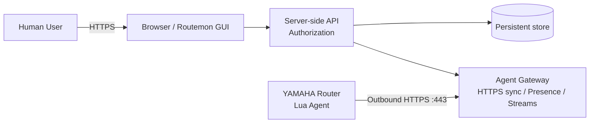
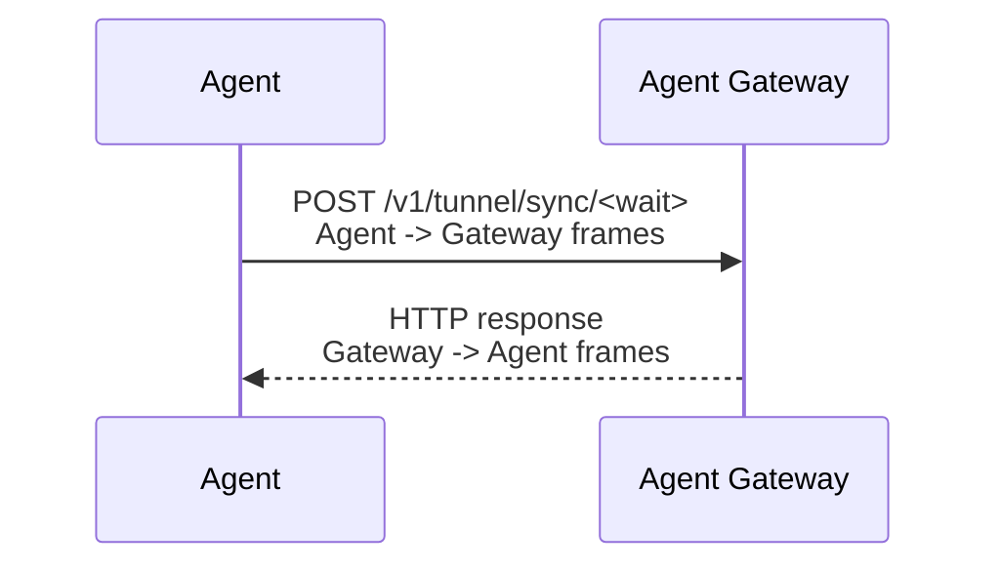

# Routemon Core Architecture

Status: Current specification  
Scope: Core  
Last updated: 2026-09-15

Related:

- `docs/architecture.md`(全体概要)
- `docs/adr/0001-https-agent-transport.md`
- Community固有のarchitecture: `docs/community/architecture.md`

## 1. Purpose

本ドキュメントは、deployment方式に依存しないarchitecture(Router Agent、Agent transport、Agent Gateway、Device Profile、Agent Update、WebGUI relay、Presence、データ境界)を定義する。

Communityのdeployment(単一ServerのSelf-Hosted)は、`docs/community/architecture.md`で定義する。

---

## 2. Goals

- ルーター単体で完結する
- Raspberry Pi、Linuxサーバー、Windows Agent等の拠点内補助機器を要求しない
- 管理対象ルーターへのinbound port forwardを要求しない
- 固定グローバルIPを要求しない
- NAT / NAPT配下から利用できる
- Router側から開始するoutbound HTTPS/TCP 443を標準管理チャネルとする
- WebGUI Forwarderを提供する
- 任意YAMAHA CLI commandを同一Agent基盤上で実行できる
- CONFIG、Telemetry、Event、SYSLOGを同じAgent基盤へ統合できる
- 複数Device / Site / Groupを管理できる

Routemonは本家YNOのプロトコル互換実装を目的としない。公開API / 公開仕様と、ユーザー管理下の実機挙動を利用した独立実装とする。

---

## 3. Components



| Component | 責務 | 文書 |
|---|---|---|
| Router / Lua Agent | thin data-plane agent(§4) | `docs/core/agent-update-design.md`、`docs/core/device-enrollment-design.md` |
| Agent Gateway | HTTPS sync終端、Agent認証、framing / routing、Presence、Data Plane入口 | `docs/core/agent-gateway-design.md` |
| Server-side API | Authorization、Device管理、Device Profile、CONFIG / SYSLOG管理 | `docs/core/access-control-design.md` ほか |
| Persistent store | 永続データ(論理モデル) | `docs/core/data-model.md` |

Server-side APIとPersistent storeの実装は、Communityでは、単一のRoutemon Server + SQLite / Local filesystemである。

---

## 4. Router Agent responsibility

Agentはthin data-plane agentとする。

Agentが担当する:

```text
HTTPS sync
frame transport
rt.command()
CONFIG取得 / 送信
SYSLOG収集 / 送信
WebGUI relay
```

Agentが担当しない:

```text
CONFIG semantic parser
Device Profile判定
CONFIG hash / diff
複雑なProduct logic
```

これによりServer側の更新だけで機能を拡張できる。

---

## 5. Router-Agent transport

Router ↔ Agent Gateway間の標準transportは**HTTPS/TCP 443**であり、YAMAHA Luaの`rt.httprequest()`を利用する(ADR-0001)。独自raw TCP transportは、開発・診断・性能baselineとして保持するが標準transportにはしない。

### 5.1 HTTPS sync model



1回のHTTP request/responseで双方向のpending frameを交換する。streamがactiveな間は短いcycle、idle時はlong-poll相当の待機を利用する。

Agent channel上では複数種類の通信(Command、WebGUI stream、Telemetry、Event、CONFIG、SYSLOG)をframing / multiplexする。frame format / typeを含むAgent Protocolの正本は`docs/core/agent-protocol.md`である。

### 5.2 Liveness

Agentに処理対象が無い場合でもidle syncの中でHEARTBEAT frameを送る。生存判定にはHEARTBEATだけでなく、認証・検証済みのHTTPS sync、WebGUI stream traffic、Command response、Telemetry、Event、CONFIG、SYSLOG batchも利用できる(`docs/core/data-model.md` §5)。

### 5.3 Reconnect and resilience

AgentはAgent Gateway / network failureを前提に、exponential backoffで再接続する。RTX830実機でGateway再起動後の自動復帰を確認済みである。Router reboot後もAgentを自動起動する。

### 5.4 TLS termination

Agent endpointのTLS終端は、`rt.httprequest()`が接続できるものにする。RTX830の`rt.httprequest()`はCloudflare Workers / Tunnel系edgeへのTLS接続でhandshake failureとなることを実機確認している(`docs/core/agent-gateway-design.md` §3)。

---

## 6. Device Profile

Deviceの詳細情報は以下を合成して生成する。

```text
Configuration facts
+
Runtime Status
+
Gateway Observation
=
Normalized Device Profile
```

- CONFIG解析はServer側のCore Parserで行う。Parser項目はRouter Agentの更新なしでServer側で拡張できる
- Router / Agent起動時はCONFIG snapshot送信を必須とする
- CONFIG変更時のtriggerはIssue #5の検証結果で確定する

詳細は`docs/core/device-profile-discovery-design.md`を参照する。

---

## 7. Agent Update

Router側を以下に分離する。

```text
Bootstrap / Supervisor
Device config
Agent A / B slots
```

- current stableを直接上書きしない
- inactive slotへcandidateを取得する
- Agent Gatewayとのauthenticated sync成功後にactive化する
- 失敗時はrollbackする
- Agent artifactはAgent GatewayのHTTPS endpoint経由で取得する
- Bootstrapは極力固定する

詳細は`docs/core/agent-update-design.md`を参照する。

---

## 8. Enrollment

Human UserがWeb UIでPending Deviceを作成し、短命Enrollment CodeをRouterへ渡す方式を採用する。

- Enrollment Codeは短命・一回限り
- Enrollment Code平文を保存しない
- Enrollment成功後はEnrollment secretを破棄し、通常通信にはDevice固有credentialを使用する
- Routerから任意`tenant_id`を自己申告させない
- Enrollment時にAgent Gateway endpointをAgentへ配布する

詳細は`docs/core/device-enrollment-design.md`を参照する。

---

## 9. WebGUI relay

Lua AgentはRouter自身のWebGUIへTCP自己接続し、HTTP byte streamをAgent Gatewayへ中継する。Router自身以外への任意LAN pivotにはしない。Native WebGUIはAdmin onlyとする。

詳細は`docs/core/webgui-relay-design.md`を参照する。

---

## 10. Data and presence boundary

- 永続データの正本は、Serverの永続storageに置く。論理モデルは`docs/core/data-model.md`
- リアルタイムPresenceは現在Agentを観測しているAgent Gatewayが保持し、永続storageへHeartbeatごとに書かない
- Agent Gatewayに復旧不能な永続stateを置かない
- Agent Gateway障害時に配下Agentを即Offlineと断定しない(Unknown)
- Online / Offlineの現在値は永続化しないが、状態遷移はEventとして永続化できる
- IP addressはGateway observedとAgent reportedを別sourceとして管理し、変更時のみ履歴を残す

---

## 11. SYSLOG

SYSLOGはLive Logs(Agent Gatewayからrealtime配信)、Raw SYSLOG(Serverのstorage)、Structured Event(永続Event)の3層に分離する。専用全文検索indexは標準構成に含めず、検索はDevice 1台 + time rangeに限定する。

詳細は`docs/core/syslog-design.md`を参照する。

---

## 12. Security boundaries

### Human side

- Authentication後、Membership / RoleでAuthorizationを行う(`docs/core/access-control-design.md`)
- privileged actionの前にDevice access checkを行う
- SYSLOG / CONFIG等の機密情報は個別permission分離可能にする

### Agent side

- Agent GatewayへのHTTPS/TLS
- per-Device credential
- credential revocation / rotation
- Enrollment credentialとpermanent Device credentialを分離
- secretを通常ログへ出力しない

### WebGUI side

- Browserが任意Router / LAN addressを直接指定できない
- GUI sessionはauthorized Deviceへscope
- arbitrary LAN pivot / generic SSRF proxyにしない

---

## 13. Current implementation status

### Verified by PoC / real RTX830

- `rt.command()`によるcommand execution
- LuaからRouter native WebGUIへのTCP self-connect
- WebGUI HTTP byte relay
- multiplexed GUI streams
- Agent reconnect / backoff
- Router / Agent Gateway間HTTPS transport
- HTTPS sync optimization
- 12 parallel GUI requests
- WebGUI payload byte-equivalence against baseline
- Gateway restart後のAgent reconnect

### Retained as baseline / fallback

- raw TCP mux Agent / Gateway(標準構成ではないが、性能比較・診断用として保持する)

---

## 14. Architecture rules

1. Router単体完結を崩さない。
2. Routerへのinbound公開を前提にしない。
3. 標準Agent transportはHTTPS/TCP 443とする。
4. `rt.httprequest()`が接続できないedge(Cloudflare Workers / Tunnel等)でのAgent TLS終端を前提にしない。
5. AgentはCONFIG parser等のProduct logicを持たないthin data-plane agentとする。
6. HeartbeatごとのOnline / Offline / 現在接続先を永続storageへ書かない。
7. live Presenceは現在Agentを観測するAgent Gatewayで管理する。
8. Agent Gatewayに復旧不能な永続stateを置かない。
9. Agent Gateway障害時に配下Agentを即Offlineと断定しない。
10. WebGUI relayを任意LAN pivotへ拡張しない。
11. Deviceは最初からTenant / Site / Groupと関連付け可能にする。
12. Enrollment secretとpermanent Device credentialを分離する。
13. SYSLOG専用全文検索indexを標準構成に含めない。
