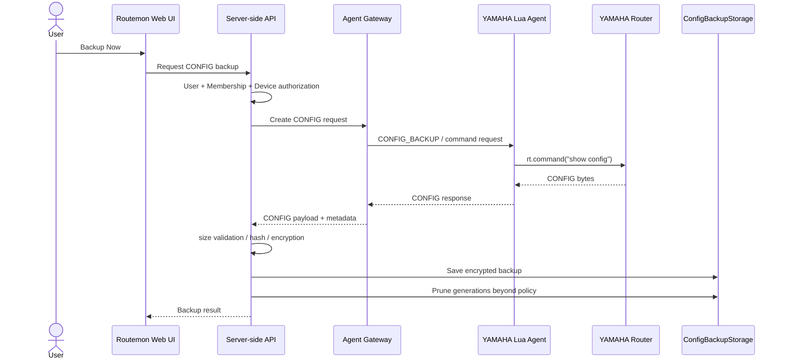
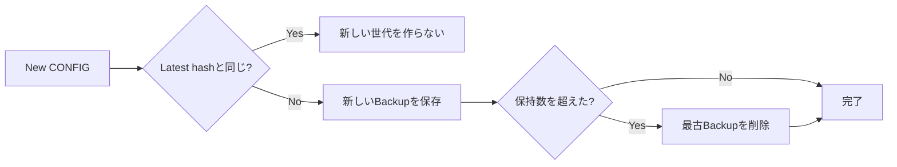
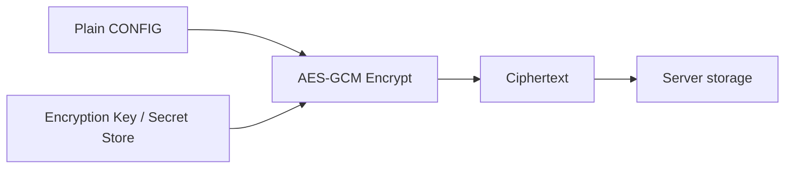
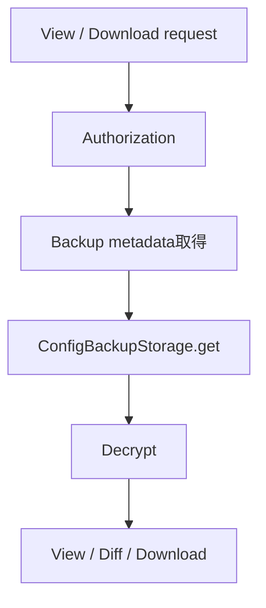

# Routemon CONFIG Backup Design

Status: Current specification (v0.1)  
Scope: Core  
Last updated: 2026-09-14

Related:

- `docs/core/data-model.md`(ConfigBackup)
- `docs/core/device-profile-discovery-design.md`
- 保存方式: `docs/community/storage-backup-design.md` §5・§6

## 1. Purpose

本ドキュメントは、Routemon における YAMAHA Router CONFIG の取得・保存・閲覧・世代管理・暗号化について、deployment方式に依存しない仕組みを定義する。

保存先と保持世代数の既定値は、`docs/community/storage-backup-design.md`で定義する。

v0.1 では、ユーザーが Device Detail の GUI から明示的に CONFIG Backup を実行できることを主対象とする。

共通方針:

- Device ごとに CONFIG を世代管理する(保持世代数は設定で定める)
- CONFIG 本文は application-level encryption 後の ciphertext として保存する
- 同一内容を重複世代として保存しない
- CONFIG の取得・保存先を UI / API から隠蔽する
- 自動 Restore / Apply は v0.1 の CONFIG Backup 機能には含めない

---

## 2. Scope

### Included in v0.1

- GUI からの手動 CONFIG Backup
- 設定で定めた世代数の保持
- Backup 一覧表示
- CONFIG 閲覧
- CONFIG Download
- 世代間 Diff
- 取得日時、Firmware、Hostname 等の metadata 保存
- CONFIG 本文の暗号化保存
- 同一 CONFIG の重複保存抑止
- storage abstraction

### Not included in initial v0.1

- CONFIG の Router への自動 Restore
- CONFIG の自動 Apply
- 定期自動 Backup
- 保持世代数を超える長期 Archive
- Config Template / Golden Config
- 複数 Device への一括 Apply

これらは Device / Agent / Authorization 基盤が安定した後に追加する。

---

## 3. User experience

Device Detail に CONFIG Backup セクションを設ける。

概念例:

```text
CONFIG Backup

2026-09-12 20:15  Rev.15.xx  [View] [Diff] [Download]
2026-09-10 11:32  Rev.15.xx  [View] [Diff] [Download]
2026-09-01 09:20  Rev.15.xx  [View] [Diff] [Download]

[ Backup Now ]
```

`Backup Now` 実行時、同一 Device の最新 Backup と内容が同じ場合は新しい世代を作成せず、UI には `CONFIG に変更はありません` 等を返す。

CONFIG Backup は privileged operation として扱い、対象 Device への read 権限とは別に、必要に応じて CONFIG 閲覧 / Download 権限を RBAC で制御可能な構造にする。

---

## 4. Backup flow



実装上、`show config` を Agent 内部の専用 CONFIG 処理としてラップしてもよい。ユーザーから任意 command string を直接渡す必要はない。

---

## 5. Generation management

各 Device について、設定で定めた世代数だけ保持する。新しい異なる CONFIG が保存された後、保持数を超えた最古の世代を削除する。



保持世代数の既定値は、`docs/community/database-design.md` §5(既定30世代)で定義する。

「世代管理できる」ことはCoreの仕組み、「何世代を標準保持するか」はServerの設定である。

---

## 6. Data model

CONFIG Backup は Device へ直接属性を追加せず、独立した entity で世代管理する。論理モデルは`docs/core/data-model.md` §4.12に従う。

Physical schema と保存先は、`docs/community/storage-backup-design.md`で定義する。

---

## 7. Encryption and secret handling

YAMAHA CONFIG には以下のような機密情報が含まれる可能性がある。

- VPN / IPsec 関連 secret
- PPP / provider credential
- User / authentication 設定
- SNMP community 等
- Network topology / private address information

したがって CONFIG 本文を通常の Device metadata と同じ扱いにしない。

### 7.1 Application-level encryption

CONFIG 本文は保存前に application layer で暗号化する。

推奨方式:

- AES-256-GCM 等の authenticated encryption
- backup ごとに random nonce を生成
- encryption key は CONFIG と同じ storage に保存しない
- key material は secret store で管理する(Community: Instance固有の master key)
- `encryption_version` を保持し、将来 key rotation / algorithm migration を可能にする



### 7.2 Hash

`content_hash` は CONFIG の exact bytes に対して算出し、重複判定と integrity check に利用する。

少なくとも UI / public API へ hash を不要に露出しない。

CONFIG の line ending や文字 encoding を保存時に勝手に canonicalize せず、Router から取得した content を復元可能な形で保持する。

### 7.3 Logging

以下を application log に出力しない。

- CONFIG plaintext
- Device Token
- Encryption key
- Enrollment Code plaintext

エラー時も CONFIG 全文を exception / trace / request dump に含めない。

---

## 8. Read / View / Download

UI / API は保存先を意識しない。



アプリケーションコードでは CONFIG storage を repository/service 層で隠蔽する。

概念 interface:

```text
ConfigBackupStorage
- save(...)
- get(...)
- delete(...)
```

Business logic や UI API から保存先の違いを直接扱わない。実装は、Communityでは、Local filesystemである。

---

## 9. Diff

世代間 Diff は保存済み CONFIG を復号後、Server 側で生成する。

初期実装では text diff でよい。

対象例:

```text
Backup #1 vs Backup #2
Backup #2 vs Backup #3
Current selected backup vs another selected backup
```

Diff 結果自体を恒久保存する必要はなく、要求時に生成する。

CONFIG には secret が含まれる可能性があるため、Diff 表示にも CONFIG 閲覧と同等の authorization を要求する。

---

## 10. Storage

| Metadata | Encrypted body | 文書 |
|---|---|---|
| SQLite | Local filesystem | `docs/community/storage-backup-design.md` §5・§6 |

---

## 11. Failure handling

### Agent / Router failure

CONFIG 取得途中で Agent communication が失敗した場合、Backup record を成功状態として保存しない。

### Encryption failure

暗号化に失敗した場合、plaintext を fallback 保存しない。

### Storage write failure

既存 Backup は削除せず、新規 Backup を失敗扱いとする。

保持数を超えた古い Backup の削除は、新規 Backup の保存成功後に行う。

---

## 12. Authorization and audit

最低限、以下の操作は authorization / audit 対象とする。

- Backup 実行
- CONFIG View
- CONFIG Download
- CONFIG Diff
- Backup Delete（将来提供する場合）

Audit では以下を記録できる構造にする。

- tenant_id
- user_id
- device_id
- backup_id
- operation
- timestamp
- result

CONFIG 本文そのものは Audit Event へ入れない。

---

## 13. Size and safety limits

Agent / Agent Gateway / Server の各段階で CONFIG payload の最大サイズを設定する。

保存先 storage の制約だけに依存せず、Routemon 自身の application limit を設ける。

具体的な最大値は実機 CONFIG サイズ測定後に確定する。

上限超過時は truncate して成功扱いにせず、Backup failure として明示する。

---

## 14. Future extensions

同じ設計を基礎として、将来以下を追加できる。

- scheduled automatic backup
- Backup 世代数を plan / policy ごとに変更
- pre-change automatic backup
- CONFIG Restore / Apply
- Config drift detection
- Golden Config
- Config compliance check
- long-term archive
- Backup export / import

Restore / Apply を実装する場合は、Backup と同じ read authorization だけでは不十分であり、書き込み用 RBAC、確認 UI、Audit、rollback を別途設計する。

---

## 15. Current decision summary

Routemon v0.1 の CONFIG Backup は以下を共通の標準とする。

1. GUI からユーザーが手動 Backup を実行する。
2. Device ごとに設定で定めた世代数を保持する。
3. 同一 CONFIG は新しい世代として重複保存しない。
4. CONFIG 本文は application-level encryption して保存する。
5. 保存先は `ConfigBackupStorage` により抽象化し、UI / API から保存先の違いを隠蔽する。
6. v0.1 では Backup / View / Diff / Download までとし、Router への Restore / Apply は別フェーズとする。
