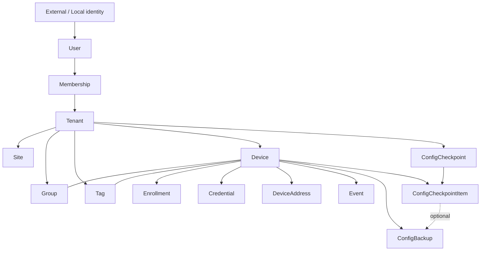

# Data Model

Status: Current specification  
Scope: Core  
Last updated: 2026-09-14

Related:

- `docs/core/access-control-design.md`
- `docs/core/agent-gateway-design.md`
- Physical schema: `docs/community/database-design.md`(SQLite、#11で確定)

## 1. Purpose

本ドキュメントは、DB非依存なlogical entity / relationship / invariantを定義する。

具体的なtable / column type / index / migrationは、`docs/community/database-design.md`で定義する。

---

## 2. Principles

### 2.1 Internal IDs

外部Identity Provider等のIDをRoutemon内部の主キーとして直接使用しない。Routemon内部IDを発行し、外部Identityとのmappingを保持する。

### 2.2 Tenant scope

Tenant-scoped dataは、Tenant境界をauthoritativeな親から一意に導出できなければならない。

- top-levelのTenant-scoped entity(Membership、Site、Group、Tag、Device、Event、ConfigBackup、ConfigCheckpoint)は`tenant_id`を持つ
- Device配下のentity(Enrollment、Credential、DeviceAddress)やDeviceとGroup / Tagの関連は、`device_id`等の親を経由してTenantを導出してよい
- API層では必ずTenant authorizationを行い、親entityを辿ってTenant所属を検証する(§8)

CommunityはTenant recordを1件だけ持ち(1 Instance = 1 Tenant)、同じ論理モデルを使う。

### 2.3 Presence is derived

Agentのリアルタイム状態(Online / Offline、最終観測時刻、現在接続中のAgent Gateway)を、永続storageの高頻度更新値として持たない。Agent Gatewayの観測から導出する(§5)。

### 2.4 Device lifecycle and Agent presence are separate

Device lifecycleはAgent Online / Offlineとは別概念である。

- `pending`: Web上で作成済み、Enrollment未完了
- `active`: Enrollment完了、管理対象として有効
- `disabled`: 管理停止

### 2.5 Secrets are not stored in plaintext

Enrollment Code、Device Token等のSecretを平文保存しない。CONFIG本文もapplication-level encryption後のciphertextとして保存する(`docs/core/config-backup-design.md`)。

### 2.6 High-volume data stays out of the relational store

以下をrelational storeへ高頻度保存しない。

- HeartbeatごとのPresence
- 現在接続中のAgent Gatewayの変化
- WebGUI stream bytes
- Raw SYSLOG lines
- 大量Telemetry raw samples

保存先は、`docs/community/storage-backup-design.md`で定義する。

---

## 3. Logical relationships



```text
Tenant
  +-- Site       物理拠点
  +-- Group      管理上の論理分類、複数所属可
  +-- Tag        軽量ラベル、複数付与可
  +-- ConfigCheckpoint  複数Deviceの取得をまとめる作業前記録
  `-- Device
```

---

## 4. Entities

### 4.1 User

RoutemonのUser。Authentication基盤(Community: Local Auth)のIdentityとmappingする。

- Authorization、関連付け、Auditでは内部User IDを使用する
- `email`だけを認可Identityとして使用しない

### 4.2 Tenant

Device等の所有単位。個人利用でもTenantを作成し、DeviceをUserへ直接ぶら下げない。

### 4.3 Membership

UserとTenantの関係と、そのTenantでのRole。

Role:

- `admin`
- `viewer`

権限内容は`docs/core/access-control-design.md`に従う。

### 4.4 Site

Deviceの物理設置拠点。Deviceは原則1 Siteに所属する。

### 4.5 Group

管理上の論理グループ。Deviceは複数Groupへ所属可能。親Groupによる将来の階層化を許容する(MVP UIで階層編集は必須としない)。

### 4.6 Tag

軽量ラベル。Tenant内で名前は一意とする。

### 4.7 Device

管理対象YAMAHA Device。

User-editable:

- name / description / notes
- Site / Groups / Tags
- role / environment / criticality / location_detail

Agent / system-managed:

- model / serial_number / firmware_revision / hostname / agent_version
- registered_at
- lifecycle(§2.4)

Agent Online / Offline、最終観測時刻、現在接続中のAgent GatewayはDeviceの属性として保存しない(§5)。

### 4.8 Enrollment

Bootstrap / Enrollment用の短命Credential。

- 短時間のみ有効
- 原則1回のみ使用可能
- Code平文は保存しない
- Code発行時点でDeviceはTenantへ紐付いている
- Agentから`tenant_id`を自由指定させない

Enrollment方式は`docs/core/device-enrollment-design.md`に従う。

### 4.9 Credential

正式Agent認証用Credential。

- Device Token平文は保存しない
- 状態: `active` / `revoked`
- 複数Credentialを許容し、将来のrotationを可能にする
- 最終使用時刻をHeartbeatごとに更新することは必須としない

Enrollment用Credentialと正式Device Credentialを分離する。

### 4.10 DeviceAddress

IPv4 / IPv6の現在値兼履歴。

- family: `ipv4` / `ipv6`
- source: `observed`(Agent GatewayがHTTPS source addressとして観測) / `agent`(Router / Agentが自身のinterface情報として報告)
- 現在値は終了時刻を持たないrecord
- 同一AddressをHeartbeatごとに更新せず、Address変更時に旧recordを終了し新recordを作成する

Router内部で認識するWAN addressとAgent Gatewayが観測したsource addressは同一とは限らないため、別に保持する。

### 4.11 Event

Routemonが意味を理解した状態変化・障害等のStructured Event履歴。

Initial candidates:

- `AGENT_OFFLINE`
- `AGENT_RECOVERED`
- `IP_CHANGED`
- `REBOOTED`
- `PPP_DOWN` / `PPP_UP`
- `TUNNEL_DOWN` / `TUNNEL_UP`

Raw SYSLOG行そのものをEventへ複製しない(`docs/core/syslog-design.md`)。

**記録の抑制(#158、ADR-0008 §11):** 回線が不安定なDeviceが、Event一覧のノイズ、容量の増加、将来の通知の過剰を引き起こさないよう、Event(`device_events`)の記録は次のとおり抑制する。数値は初期値で、設定で変えられる(Communityの環境変数`EVENT_FLAP_WINDOW_MS` / `EVENT_FLAP_THRESHOLD` / `EVENT_DAILY_CAP` / `EVENT_RETENTION_DAYS` / `EVENT_CLEANUP_MS`)。

- **フラッピング:** 同じDeviceの同じ対象(PPP、Tunnelなど)の状態変化が、10分間に5回以上起きたら、個別のEventを止めて、1件の`event.flapping`にまとめる(5回目の状態変化の時点で記録し、その回の個別のEventは記録しない)。状態変化が10分間途絶えたら、個別の記録を再開する。状態変化のEventだけが対象で、呼び出し側が対象を識別する`transitionKey`を渡したときに判定する
- **1日の上限:** Deviceごとに、1日(UTC)に記録できるEventは200件まで。超えたら`event.limit_reached`を1件だけ記録し、その日の残りは捨てる。翌日(UTC)にリセットされる
- **保持期間:** 90日を過ぎたEventを、毎日の処理(`cleanup`)で削除する

判定はServer(Gateway)側で行う。Gatewayは、Deviceごとの状態を持っているため、Eventの書き込みの要求も減らせる。

### 4.12 ConfigBackup

CONFIG Backupの世代。Deviceへ直接属性を追加せず、独立したentityで世代管理する。

Metadata:

- content hash / size
- encryption version / nonce
- firmware_revision / hostname
- source(`manual`、将来`scheduled` / `before_change`)
- 実行User
- captured_at

本文はciphertextとして、Serverのstorageへ保存する。仕組みは`docs/core/config-backup-design.md`に従う。

### 4.13 ConfigCheckpoint

複数DeviceのCONFIG取得を同じ作業前スナップショットとしてまとめる。checkpointはCONFIG本文を複製せず、Deviceごとの取得結果と、成功した場合のConfigBackup参照を保持する。

- checkpoint itemは対象Deviceごとに1件作り、`pending` / `captured` / `failed`を記録する
- `captured`はCONFIGを受信し、ConfigBackupの世代を確認できた場合だけにする
- ConfigBackupが世代保持で削除されても、itemと取得時刻は残し、backup参照は空にする
- checkpointを削除するとitemsだけを削除し、参照していたConfigBackupは削除しない
- 取得失敗とUserが付けた名前・メモを、Audit eventとCONFIG本文へ混ぜない

---

## 5. Presence semantics

RoutemonのUIでは、Routerそのものではなく**Agent Online / Agent Offline**と表現する。Agentが見えない原因はRouter電源断に限らず、WAN断、DNS障害、Agent停止、Agent Gateway到達不能等も含むためである。

Agent Gatewayは少なくとも以下を保持する。

```text
presence[device_id]
- last_seen_at
- observed_source_ip
- active_transport_state
```

- `last_seen_at`は認証成功した正常なAgent通信時に更新する
- HEARTBEATだけでなく、HTTPS sync、WebGUI relay traffic、Command response、Telemetry、CONFIG / Event trafficも生存証明として扱える

Derived status:

```text
Agent Online
Agent Unstable
Agent Offline
Agent Unknown
```

- 想定時間内に観測 -> Online、一定時間遅延 -> Unstable、timeout超過 -> Offline
- Agent Gatewayが異常またはhealth不明の場合、Agentを観測できなくてもOfflineと断定せずUnknownとする
- Agent Gateway再起動直後はPresenceが空になるため一時的にUnknownとし、次のsync / heartbeat受信後にOnlineへ復帰させる

具体的なinterval / timeout値はAgent実装時に調整する。

---

## 6. Enrollment transitions

```text
1. UserがLogin
2. Tenant内で機器追加
3. Device作成(lifecycle = pending)
4. Enrollment作成、Enrollment Code発行
5. Router bootstrap -> Agent GatewayへEnrollment
6. Code検証
7. Router情報(model / serial / firmware / hostname)取得
8. Device Token発行、Credential作成
9. Device更新(lifecycle = active、registered_at、agent_version)
10. Enrollmentを使用済みにする
11. AgentへAgent Gateway endpointを配布
12. Agent正式起動
13. Agent GatewayのPresenceにDevice出現
14. UIでAgent Online表示
```

Enrollment CodeからTenantと接続先を決定し、Router側から任意のTenant IDを指定させない。

---

## 7. Timestamp convention

内部timestampはUTCを正本とする。ISO 8601 text等の統一形式を採用し、UI表示時にUser timezoneへ変換する。

---

## 8. Application validation

DBのForeign Keyを利用する場合でも、Tenant境界の検証をDB制約だけに依存しない。

API層で以下を必ず確認する。

- Userが対象Tenantへ所属している
- User Roleが操作を許可している
- Deviceが対象Tenantに所属している
- Site / Group / Tagが同一Tenantに所属している
- WebGUI / SYSLOG / CONFIG sessionが対象Deviceへscopeされている

IDを知っているだけで別Tenantのrecordを参照・更新できないようにする。

---

## 9. Follow-up design items

- Routemon内部ID生成方式
- Device Token format / hash / rotation
- Enrollment Code format / lifetime
- Agent Online / Unstable / Offline threshold
- RBAC permission matrix
- Audit Log schema
- Monitoring / Telemetry schema
- Structured Event parser scope
