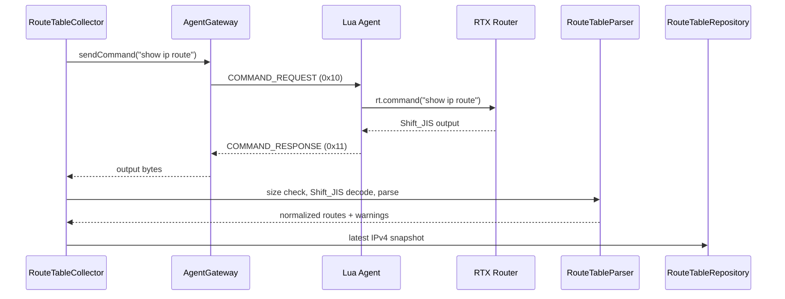

# Route Table Collection Design

Status: Proposal for design review (Issue #130)

Scope: Core / Community / Web

Last updated: 2026-09-26

Related:

- `docs/core/data-model.md`
- `docs/core/topology-design.md`
- `docs/core/agent-protocol.md`
- `docs/core/lua-api-notes.md`
- `docs/core/device-profile-discovery-design.md` §5.4
- `apps/community/src/devices/runtime.ts`
- `apps/community/src/config/reconcile.ts`
- YAMAHA [IPv4 route command reference](https://www.rtpro.yamaha.co.jp/RT/manual/rt-common/showstatus/show_ip_route.html)
- YAMAHA [IPv6 route command reference](https://www.rtpro.yamaha.co.jp/RT/manual/rt-common/showstatus/show_ipv6_route.html)
- YAMAHA [IPv6 route output example](https://www.rtpro.yamaha.co.jp/RT/ipv6/usage.html)
- YAMAHA [route output example and explanation](https://network.yamaha.com/setting/router_firewall/ts_router/server_release)

本書は、Issue #105 の実装に先立って、ルーターの経路表を読み取り、DeviceのObserved情報として保存・表示する方法を定める。POの承認後に実装Issueを作成する。

## 1. 目的と範囲

CONFIGから解析する静的経路(Configured)と、ルーターが現在保持する経路表(Observed)を、Device詳細で別の情報源として確認できるようにする。Observedには、静的経路の有効状態、接続に伴う経路、動的ルーティングで学習した経路などが含まれる。

初期実装の範囲:

- `show ip route` と `show ipv6 route` の定期取得
- 取得した結果の解析と最新値の保存
- Adminによる手動再取得
- Device詳細「経路」タブでのConfigured / Observed表示
- Topology Modelのroute factに `observed` evidenceを加える

経路の追加・削除、ルーター設定変更、リアルタイムPolling、経路変化アラートは対象外とする。

## 2. 調査結果

### 2.1 RTX830の出力

検証機RTX830 Rev.15.02.30でCLIから `show ip route` と `show ipv6 route` を実行した。以下は表示構造を示すための例であり、IPアドレスは文書用アドレスへ置き換えている。

```text
宛先ネットワーク    ゲートウェイ     インタフェース  種別      付加情報
default             -                PP[01]          static    filter:500000
198.51.100.2/32     -                PP[01]          temporary
192.168.100.0/24    192.168.100.1    LAN1            implicit
```

IPv4の列は宛先、gateway、interface、種別、付加情報である。確認できた種別は `static`、`temporary`、`implicit`。`default` はIPv4 default routeとして出力される。`implicit` はLANの接続経路など自動生成された経路に使われ、他の機能が作る暗黙的な経路にも使われるため、単純に「接続経路」と同一視しない。

検証機のIPv4出力は5経路だった。これは経路数や出力byte数の上限を示すものではない。実機CLIでは日本語見出しが端末上で文字化けしたため、列名は公開リファレンスと照合した。IPv6は同じコマンドで取得できることをCLIで確認したが、検証時の経路表は空だった。空の経路表でもコマンドは成功し、見出しのみが表示された。

公開されているIPv6の出力例ではDestination、Gateway、Interface、Type列と`default`表記が使われている。実機では空tableの見出しが日本語で表示された。Parserは日本語 / 英語の既知headerを認識し、`default`とfamily固有の`0.0.0.0/0` / `::/0`表記を同じdefault route factへ正規化する。

YAMAHAの公開リファレンスは、IPv4 / IPv6とも通常表示、`detail`、`summary` を定義している。通常表示は現在の経路情報、`detail` は優先度で隠された静的経路も含み、`summary` はプロトコルごとの件数を返す。初期実装では現在有効な経路表を表示するため通常表示を使う。`detail` は有効な経路と隠れた経路が混ざり利用者に誤解を与えるため、`summary` は経路一覧にならないため使わない。

YAMAHAの出力例では、静的経路は `static`、RIP経路は `RIP metric=1`、OSPF経路は `OSPF cost=...` のように表示される。付加情報はプロトコルや機能により異なる。フィルタ番号など、数値を含む付加情報を一律にmetricとみなしてはならない。[IPv4 command reference](https://www.rtpro.yamaha.co.jp/RT/manual/rt-common/showstatus/show_ip_route.html) は、RIPのmetric、OSPFの内部 / 外部区分・cost・外部経路metric、BGPのmetricなしを説明している。出力例はYAMAHAの[RIP経路例](https://www.rtpro.yamaha.co.jp/RT/FAQ/Queue/try-bandwidth-measuring1.html)と[OSPF経路例](https://www.rtpro.yamaha.co.jp/RT/docs/multipoint-tunnel/index.html)を参照した。[YAMAHAの設定例](https://www.rtpro.yamaha.co.jp/RT/docs/nat-descriptor/hairpin_nat.html) には `implicit` の利用例がある。

### 2.2 機種・Firmware差

公開リファレンスの適用モデルにRTX830を含む一方、出力例は設定、接続状態、導入機能、Firmwareにより変わる。YAMAHAはrouteの列とdynamic protocol別の付加情報を説明しているが、すべての機種・Firmwareの全行形式を固定した文法としては公開していない。したがって、Parserは未知の種別・付加情報を許容し、既知行だけを正規化する。

### 2.3 Agent経由での取得

既存の`DeviceRuntime`はGatewayの`sendCommand()`から`show environment`を要求し、返却byte列をShift_JISでdecodeしている。COMMAND_REQUEST / COMMAND_RESPONSEも、任意のCLI commandを`rt.command()`へ渡す既存仕様である。コマンド文字列の上限は4095文字であり、この2コマンドに影響しない。よって、現在のAgentがCOMMANDを処理できる接続先につながっている限り、経路表取得のためのLua変更は不要である。

今回確認したのはCLI出力までであり、COMMAND frame経由では実行していない。実機Agentの接続先を確認できず、調査時にport 18085のlistenerも見つからなかった。稼働中の開発用Gatewayはport 9445、Community ServerのAgent endpoint既定値はport 8081であり、どちらも実機Agentが接続中のServerだとは確認できていない。実機の接続先と適切なServer起動方法を確定してから、COMMAND経由の応答byte数・分割・timeoutを検証する必要がある。

## 3. 取得構成



CollectorはIPv4とIPv6を順番に取得する。1つのRouterに同時に複数commandを投げず、2 familyのうち一方が失敗しても他方の成功を保存する。取得失敗、timeout、上限超過、既知の見出しを確認できない出力は最新成功値を置き換えない。

COMMAND_REQUESTのtimeout時はGateway仕様に従って再送しない。次の定期取得かAdminの手動再取得で再試行する。

## 4. 取得の契機と間隔

CONFIG定期取得(#81)と同じ考え方を採用する。

- 定期取得は24時間に1回
- 10分ごとの軽いsweepで取得時刻を確認する
- Device IDごとの安定した位相へ分散し、Server起動時の一斉取得を避ける
- activeかつGatewayからonlineと観測できるDeviceだけを取得する
- 取得時刻にofflineなら要求を失敗扱いにせず、online復帰後のsweepで一度取得する
- Agent再接続のたびに経路表を即時取得しない

初回取得も位相に従って分散する。初回をすぐに見たい場合はAdminが手動再取得を行う。既存`DeviceRuntime`の10分間隔は起動時刻のRuntime情報に使うものであり、変化の多い経路表へ流用しない。

Device詳細からAdmin向けに「再取得」を設ける。これは同じ固定2コマンドを実行し、任意のCLI commandは受け取らない。Viewerは保存済みObserved結果を閲覧できるが再取得できない。手動要求はAdmin操作として監査し、経路表の本文やgateway値はaudit / application logへ記録しない。定期取得は内部観測としてaudit対象外とする。

## 5. 上限、解析、失敗時の扱い

### 5.1 出力上限

`rt.command()`の出力上限は公開資料と今回のCLI調査では確認できていない。route数が多い場合の実機出力も未測定である。初期実装では1 familyのCOMMAND出力を128 KiBまで受け付ける。上限はShift_JISの受信byte数で判定し、上限を超えた結果は保存しない。既存の成功済みsnapshotを残し、取得状態を`output_too_large`とする。

128 KiBは保存・解析するroute表の上限であり、AgentからGatewayまでの転送量を制限する値ではない。Agent sync request bodyの既定上限2 MiBは引き続きGatewayで適用する。実機でCOMMAND経由の最大出力と大規模route表を確認した後、128 KiBを見直す。

### 5.2 Parser

出力byte列を既存と同じShift_JIS decoderで文字列にし、CR/LFで行に分ける。日本語 / 英語の既知headerを識別し、空行を除いたroute行はprefix、gateway、interface、種別の既知tokenを基準に読み、列幅の固定byte offsetには依存しない。IPv4 / IPv6の`default`とfamily固有のdefault prefix表記は、同じdefault destinationとして扱う。

Route factには少なくとも次を保持する。

```ts
type ObservedRoute = {
  family: "ipv4" | "ipv6";
  destination: string;
  gateway: string | null;
  interface: string | null;
  rawType: string;
  category: "static" | "dynamic" | "implicit" | "temporary" | "unknown";
  protocol?: string;
  metric?: number;
  cost?: number;
  rawDetails?: string;
};
```

`static`、既知のdynamic protocol(`RIP` / `OSPF` / `BGP`)、`implicit`、`temporary`を分類する。`implicit`は自動生成経路の種別として独立させ、「接続済み」と断定しない。`metric=`と`cost=`は一致した場合だけ数値化し、その他の付加情報は`rawDetails`へ残す。未知のtypeは`rawType`を保持し、`category: "unknown"`として表示する。

見出しを認識でき、個々のroute行だけを解析できなかった場合は、解析済みrouteと未解析行を一緒に保存して`partial`とする。未解析行は画面で警告つきで確認できるよう原文を保持する。既知の見出しを認識できない出力は、機種 / Firmwareが異なる可能性があるため`unrecognized_output`として保存を見送り、前回成功値を維持する。成功した空のIPv6表は空配列の完全なsnapshotとして扱う。

未解析行もgatewayやprefixを含み得る。保存・API・画面ではDevice route情報として扱い、raw CONFIGやCredentialとは別の情報だが、Tenant authorizationを必須にする。ログとテストfixtureに実機route outputをそのまま出さない。

## 6. 保存方式と保持

Route tableは変化しやすく、障害調査用の全世代保存より現時点の有効経路を表示することを優先する。初期実装はDevice・address familyごとに最新成功snapshotだけを保持する。同じ内容でも`captured_at`は更新し、route factを安定順に並べた`content_hash`が変わった場合だけ`changed_at`を更新する。過去世代は保持しない。

論理entity `DeviceRouteTable` はDevice配下に置く。Communityでは次の1行をDevice・familyごとにupsertするSQLite tableをmigrationで追加する。

```text
device_route_tables
  device_id              FK -> devices.id ON DELETE CASCADE
  family                 ipv4 | ipv6
  captured_at            latest successful/partial snapshot time (nullable)
  changed_at             normalized route content changed time (nullable)
  content_hash           normalized route JSON hash (nullable)
  last_attempt_at        latest attempt time
  last_attempt_status    complete | partial | failed
  last_error_code        bounded code such as timeout / output_too_large
  output_bytes           last successful/partial output size
  parser_version         parser version
  routes_json            normalized routes (nullable)
  unparsed_lines_json    unparsed route rows (nullable)
  PRIMARY KEY (device_id, family)
```

Tenant IDは重複保持せず、Deviceから導出する。失敗時は`last_attempt_*`だけを更新し、`captured_at`とroute dataは直近成功値のままにする。Device削除時はcascade deleteする。Route dataは通信上観測された運用情報としてSQLiteへ保存し、raw CONFIG Backupと異なりapplication-level暗号化は要求しない。CommunityのDB Backup / Restoreに従って保護する。

## 7. API

Community APIに次を追加する。すべての検索・更新は最初にDeviceを`tenant_id`で特定し、別TenantのIDを受け付けない。

### GET `/api/devices/:deviceId/routes`

保存済みのObserved snapshotだけを返す。Configured routeは返さず、画面は既存の`GET /api/devices/:deviceId/profile`の`routes`を使う。Routerへ接続しない。Viewerを含む認証済み利用者が呼び出せる。

```json
{
  "ipv4": {
    "capturedAt": "2026-09-25T10:05:00.000Z",
    "changedAt": "2026-09-20T08:00:00.000Z",
    "lastAttemptAt": "2026-09-25T10:05:00.000Z",
    "lastAttemptStatus": "complete",
    "routes": [],
    "unparsedLines": []
  },
  "ipv6": null
}
```

familyの取得attemptが一度も無い場合は該当する値を`null`とする。取得済みで経路が無い場合は`routes: []`とし、「未取得」と区別する。初回取得に失敗して成功済みsnapshotが無い場合は、`capturedAt: null`と失敗したattemptのstatusを返す。`lastAttemptStatus: failed`かつ`capturedAt`がある場合、前回取得内容を返したうえで前回取得失敗を示す。

### POST `/api/devices/:deviceId/routes/refresh`

Adminのみ。IPv4、IPv6を順番に再取得し、成功したfamilyだけをupsertする。結果は同じObserved-only形式(`ipv4` / `ipv6`)で返す。Deviceがofflineの場合は`409 device offline`、実行中はDevice単位で多重要求を拒否する。Audit eventにはDevice ID、実行者、結果コードを残すが、route dataは含めない。

GETはObserved route用の読み取り面、POSTはRouteTableCollectorを起動する手動操作である。Configured routeは既存のProfile APIが提供するため、新しいAPIで再掲しない。UIは各API経由で読み、DBや保存JSONを直接参照しない。

## 8. Device詳細「経路」タブ

ConfiguredとObservedを別セクションにし、Configured値をObservedの現在値として扱わない。Configuredは既存の`GET /api/devices/:deviceId/profile`の`routes`から読み、Observedは新しい`GET /api/devices/:deviceId/routes`から読み込む。Observedに同じstatic routeが出ても、情報源が違うため相互に置き換えたり一つにまとめたりしない。

```text
Device: Branch Router                         [経路]

Configured — CONFIGに設定された経路 (既存 /profile の routes)
CONFIG取得: 2026-09-25 19:00 JST
宛先              Gateway       出口         種別
default           pp 1          -            static
198.51.100.0/24   tunnel 1      TUNNEL[1]    static

Observed — ルーターが現在保持する経路表 (新規 /routes API)
最終取得: 2026-09-25 19:05 JST     [再取得] (Adminのみ)
IPv4
宛先              Gateway       出口         種別 / 付加情報
default           -             PP[01]       static / filter:...
192.168.100.0/24  192.168.100.1 LAN1         implicit
203.0.113.0/24    203.0.113.1   TUNNEL[1]    OSPF / cost=...
IPv6: 経路なし
```

Configuredには「CONFIGに書かれた設定値」、Observedには「取得日時点でRouterが持つ経路表」と常時表示する。Observedの行は`static` / `implicit` / `temporary` / dynamic protocol / unknownをbadge等で区別する。metricやcostが取得できた場合のみ表示する。

状態表示:

- Profile未取得: Configuredに`CONFIG未取得`
- snapshot未取得: familyごとに`未取得`
- 成功した空table: `経路なし`
- partial: `一部の行を解析できません`と未解析行を表示
- 最新attempt失敗: 前回snapshotとその取得日時を表示し、前回取得失敗を警告
- 現snapshotの取得時刻が24時間より古い: `古い観測`を表示

IPv4とIPv6は別々に状態・取得日時を表示する。ConfiguredとObservedをマージした単一表や、両者の一致・不一致を自動判定する表示は初期実装に含めない。

## 9. TopologyのObserved evidence

既存の`TopologyRoute`へfamily、raw type / category、protocol、metric、costの任意項目を追加できる形にし、TopologyBuilderへ最新のRouteTable snapshotを渡す。取得済みの解析可能なObserved routeをTopology Modelの`routes`へ追加する。IP gatewayは`kind: "ip"`へ、gatewayが`-`でinterfaceが分かる行は`kind: "interface"`へ写し、evidenceを次のようにする。

```ts
{
  source: "observed",
  at: snapshot.capturedAt,
  summary: snapshot.family === "ipv4" ? "show ip route" : "show ipv6 route"
}
```

Configured factsは既存どおり`source: "configured"`で残す。同じprefix / gatewayが両方に存在しても別のevidenceとして識別できるstable IDを使い、ObservedがConfiguredを上書きしない。未解析行はTopology route factへ変換せず、parser warningとしてdevice単位で伝える。

Route factは「その時点でRouterが持っていた転送情報」であり、物理接続や隣接Routerの証明ではない。初期実装ではrouteのgatewayと他Deviceを照合したLink推定を行わない。部分取得のsnapshotは認識できたrouteだけを追加し、未解析行があることをwarningで示す。

## 10. 実装Issueの分け方

設計承認後、以下の子Issueへ分ける。各Issueを1PRで完結させる。

1. **Core: route table parserとTopology observed evidence** — IPv4 / IPv6 parser、未知行・partial扱い、normalized type、TopologyBuilderへのObserved route入力とテスト。
2. **Community: route table collector / storage / API** — SQLite migration、最新snapshot repository、24時間reconcile、Admin手動再取得、GET / POST API、失敗時の前回値維持とテスト。
3. **Web: Device経路タブのObserved表示** — Configuredは既存の`GET /api/devices/:deviceId/profile`の`routes`から読み続け、新しいObserved-only APIを使ってfamily別Observed表、取得日時・古さ・partial / failure状態、Admin再取得を追加。

Agent(Lua)変更は別途不要とする。COMMAND経由の検証で既存Agentが必要な応答を返せないことが判明した場合は、この前提を変える実装Issueを追加する前に設計を再レビューする。

## 11. 未解決事項

- 実機Agentの接続先Serverと起動手順を特定し、port 18085で安全に接続できる検証環境を用意する必要がある。今回の調査ではCLIを使い、COMMAND frameでの経路表取得は確認していない。
- `rt.command()`が返せる経路表の最大byte数、COMMAND_RESPONSEの実機分割、数百・数千経路の実行時間は未確認。128 KiBの受入上限は実機のstress確認後に確定する。
- RTX830 Rev.15.02.30以外の機種 / Firmware、およびRIP / OSPF / BGPで付加情報の表記が変わる例は、実機fixtureを増やしてからParser対応範囲を決める。長いIPv6行や付加情報が端末出力で折り返される条件も未確認。

検証時にルーター設定は変更しておらず、Lua taskもterminateしていない。
