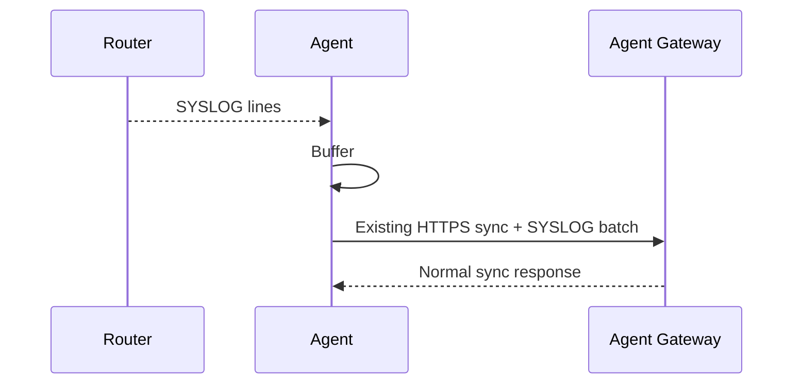
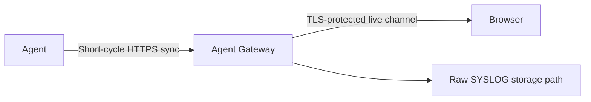
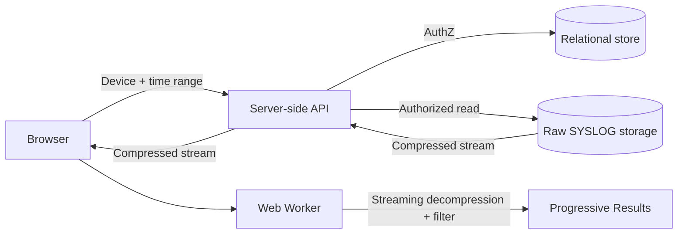

# SYSLOG Design

Status: Current specification (v0.1)  
Scope: Core  
Last updated: 2026-10-03

Related:

- `docs/adr/0001-https-agent-transport.md`
- `docs/core/data-model.md`(Event)
- `docs/core/agent-gateway-design.md`
- 保存方式: `docs/community/storage-backup-design.md` §7

## 1. Purpose

本ドキュメントは、YAMAHA Router SYSLOGの収集、Live表示、Raw SYSLOGとStructured Eventの区分、保持の考え方、検索・表示のbehaviorを定義する。

Raw SYSLOGの保存先、保持期間・容量の既定値、配送経路は、`docs/community/storage-backup-design.md`で定義する。

基本原則:

- Raw SYSLOGとStructured Eventを分離する
- Agent -> Agent Gatewayは既存HTTPS syncへpiggybackする
- 通常は約1分batch、Live時のみ短周期化する
- Raw SYSLOGは期間と容量の二重上限でboundedにする
- 専用全文検索indexは持たない
- 検索はDevice / timeで絞った小範囲に限定する
- BrowserはRaw SYSLOGの保存先へ直接アクセスしない
- Clientが指定した`tenant_id`を認可の正本にしない

Routemonは本家YNOの全機能再現を目標としない。全Device・長期間に対する高度な横断全文検索を必要とする利用者は、本家YNO等の上位製品の対象とする。

## 2. Components

| Component | Responsibility |
|---|---|
| Lua Agent | Router上のSYSLOG取得、短期buffer、HTTPS syncへのbatch搭載 |
| Agent Gateway | Agent batch受信、Live fan-out、Raw SYSLOG保存経路への受け渡し、Structured Event抽出の入口 |
| Raw SYSLOG storage | Raw SYSLOGのbounded history保存 |
| Relational store | User / Tenant / Device / RBAC、Structured Event、設定 / ポリシー |
| Browser | 認可済みHistoryの展開・小範囲filter・表示 |

## 3. Raw SYSLOG and Structured Event

Raw SYSLOGとRoutemon Eventを明確に分離する。

### 3.1 Raw SYSLOG

Routerが出力した原文を可能な限り保持する。

例:

```text
2026/09/12 22:41:02: [IKE] negotiation failed ...
```

用途:

- トラブルシュート
- 過去ログ参照
- Device単位のkeyword search
- download

保存先: Raw SYSLOG storage(Community: Local filesystem)

### 3.2 Structured Event

Routemonが意味を解釈したイベント。

例:

```json
{
  "type": "TUNNEL_DOWN",
  "severity": "warning",
  "tunnel": 1,
  "occurred_at": "2026-09-12T13:41:02Z"
}
```

用途:

- Dashboard
- Alert
- Incident history
- Notification
- 集計

保存先: Event(`docs/core/data-model.md` §4.11)

よく使う運用検索は可能な限りStructured Eventへ寄せる。

例:

- PPP down/up
- Tunnel down/up
- Agent offline/recovered
- reboot
- IP change

Raw SYSLOG全文検索を構造化Eventの代替にはしない。

## 4. Agent-side collection

### 4.1 Normal mode

Agentは取得したSYSLOGを短期bufferし、既存HTTPS syncにbatchとしてpiggybackする。

通常時の目標周期:

```text
約1分
```

SYSLOG専用HTTP requestを必須にせず、通常のAgent syncにpending SYSLOGがあれば同梱する。



### 4.2 Live mode

ユーザーがLive Logsを開いた場合、対象Deviceだけflush周期を短縮する。

目標:

```text
約1秒級
```

厳密なリアルタイム保証ではなく、実用上の低遅延表示を意味する。

Live mode終了後は通常の約1分batchへ戻す。

### 4.3 Agentのcollection(RTX830、Issue #26で実機確認)

`rt.syslogwatch()`は**呼び出している間に出た行だけ**を返し、過去の行は返さない(`docs/core/lua-api-notes.md`)。Agentはsyncやrelayで待っている間はwatchできないため、そのままでは行を落とす。

採用した構成:

```text
SYSLOG watcher task            Agent task
  rt.syslogwatch()を常時実行     syncとrelayを行う
        |                            |
        +--- local TCP(127.0.0.1)----+
             watcherが行を流し込み、Agentは待たずに読む
```

- watcherは監視専用のLua taskとして常駐し、Agentからの接続を保持したまま、行が出るたびに流す
- Agentは接続を保持し、`settimeout(0)`で読めるだけ読んで次のsyncへ載せる
- 接続のたびに張り直す方式は、watch中にacceptできずAgent側のtimeoutと行き違って行を落とすため採らない(実機で確認)
- watcherが溜められる行数・byte数には上限があり、溢れた分は古い行から捨てて、捨てた件数を1行として通知する

#### watch窓の切れ目(Issue #79で実機確認)

`rt.syslogwatch()`は指定秒数を**待ち切ってから**返すため、窓と窓の切れ目に出た行は落ちる。
RTX830での実測(1秒間隔で20行):

| watch窓 | 届いた行 | 配信遅延 |
| --- | --- | --- |
| 2秒 | 19 / 20 | 1〜3秒 |
| 10秒 | 20 / 20 | 約16秒 |

窓を長くすれば落ちにくくなるが、そのぶんLive Logsが遅くなる。そこで**Live Logs中だけ窓を短くする**。

```text
Live Logs on   -> 2秒窓 (応答性を優先)
Live Logs off  -> 10秒窓(取りこぼしにくさを優先)
```

切り替えはAgentがlocal TCPで`L1` / `L0`の1行をwatcherへ送って伝える。
AgentはGatewayからSYSLOG_LIVE frameを受け取った時点でこれを送る。

この構成でも取りこぼしが完全に無くなるわけではないため、CONFIG変更検知のように
取りこぼすと困る用途では、定期取得(`periodic_reconcile`)を併用する(#81)。

### 4.4 Agent buffer limit

Agent側bufferは無制限に増加させない。

正式実装時に以下を定義する。

- max lines
- max bytes
- max age
- overflow時のdrop policy
- dropped lines counter

Routerの限られたLua memoryを考慮し、長時間回線断時の全SYSLOG完全保持は保証しない。

### 4.5 Router停止時のSYSLOG欠落(ユーザー向け注意)

Agent bufferはRouterのメモリ上にあるため、Routerが突然停止(再起動・電源断・クラッシュ等)した場合、Gatewayへ未送信のSYSLOGは失われる。

- 通常時は約1分周期で送るため、**停止直前の最大約1分ぶんのSYSLOGは保存されないことがある**
- Gatewayへ届いたSYSLOGは、Raw SYSLOG storageへ保存され、履歴から参照できる
- Live Logsを開いている間は送信周期が短くなるため、直前のログまで届きやすい。ただし開いていない場合の保証にはならない

これは仕様上の制約として許容する。UIのHelp / Troubleshooting等でも、利用者へ明示する。

## 5. Agent Gateway receive path

Agent GatewayはAgentから受信したSYSLOG batchについて以下を実施する。

1. Agent authentication済みDeviceとして受信
2. Device -> Tenantをserver-sideで解決
3. batch size / line count上限検証
4. Live subscriberが存在すればfan-out
5. Raw SYSLOG保存経路へ受け渡す
6. 必要なら軽量なStructured Event判定へ渡す

Agent Gatewayで実施しない処理:

- 大量の全文正規表現解析
- AI解析
- 全期間全文index生成
- 高コストな検索dataset生成
- Tenant authorizationをBrowser入力だけに依存する処理

## 6. Live Logs

Live LogsはRaw SYSLOG storageを経由しない。



Browser -> Agent Gatewayのlive transportはTLS保護された方式を使用する。

候補:

- WSS
- authorized HTTPS streaming

Live sessionは必ずServer-side APIの認可を経て、Device scopeと短い有効期限を持つsession authorizationを使用する。

## 7. Retention semantics

Raw SYSLOGは**期間と容量の二重上限**で管理する。具体的な既定値は、`docs/community/storage-backup-design.md`で定義する。

保持条件は次のどちらか早い方で決まる。

```text
retention期間経過
OR
容量上限超過
```

したがってUIでは`N日保存保証`とは表示せず、`最大N日`として扱う。

容量上限到達時は、上限を1 byte超えるたびに1件削除するのではなく、古いものから削除して設定されたlow watermark以下まで戻す(ヒステリシス)。low watermarkの既定値は、`docs/community/storage-backup-design.md`で定義する。削除順序は原則oldest-firstとする。

これらの値はコードへ散在する固定値ではなく、SYSLOG policyとして設定可能な値にする。

## 8. User-facing storage status

Device Detail等で以下を表示できるようにする。

```text
SYSLOG Storage

使用量: <used> / <limit>
最大保存期間: <retention_days>日
現在の最古ログ: 2026-08-15
```

容量上限により保持期間が短くなっている場合:

```text
ログ量が多いため、容量上限により古いログが削除されています。
現在の最古ログ: 2026-09-04
```

ユーザーが`N日あるはずなのに見つからない`状態にならないよう、実効保持期間を可視化する。

## 9. History search

### 9.1 Search scope

専用全文検索indexは作成しない。

検索には以下を必須とする。

- Device 1台
- time range

任意条件:

- severity
- `keyword`: messageの部分一致(大文字小文字を区別しない)
- `exclude`: messageに含まれる行を除外(大文字小文字を区別しない部分一致)

Device / timeから対象範囲を決め、該当するRaw SYSLOGだけ取得する。全Deviceを対象とする任意keyword横断検索は提供しない。

### 9.2 Browser-side keyword filtering

Server側で大量のRaw SYSLOGを展開・全文scanしない。BrowserはRaw SYSLOG storageへ直接接続せず、Server-side APIが認可済みのデータだけをstreamする。



Community版ではlocal storageを行単位で読むため、`LocalSyslogStorage.read`で検索条件の
絞り込みもServer側で行う。圧縮streamとWeb Workerによる構成は、将来の目標として残す。

### 9.3 Browser processing requirements

ブラウザのmain threadでデータ全体を一括展開・検索しない。

以下を使用する。

- Web Worker
- streaming decompression
- line-by-line filtering
- progressive result delivery
- search cancel
- virtualized list rendering

結果が揃うまで画面をblockingせず、見つかった行から順次表示する。

### 9.4 MVP search limits

初期設計値:

```text
Device count per search       = 1
max_time_range                = 24 hours
max_compressed_transfer       = 50 MB
max_rendered_results          = 10,000 lines
```

`max_rendered_results`は1回の検索で返せる最大行数である。互換性のためAPIの`limit`省略時の
既定値は1,000行とし、10,000行まで取得する呼び出し側は`limit=10000`を明示する。GUIの
検索とdownloadはこの指定を行う。

いずれかを超える場合は検索を継続せず、期間を短くするようユーザーへ案内する。

これらも実測により調整可能な設定値とする。

検索対象を新しい時間から処理し、最近の結果を先に表示することを推奨する。

### 9.5 Download

検索結果をテキストで取得する場合は、Historyと同じDevice・期間・検索条件を指定する。

```text
GET /api/devices/{device_id}/syslog/download
```

Queryには`from`、`to`、`keyword`、`exclude`、`limit`を使用する。`keyword`と`exclude`は
大文字小文字を区別しない部分一致で評価する。10,000行上限で切り詰めた場合は、ファイルの
先頭に`# truncated at 10000 lines`のコメント行を付け、ログの終端と誤解しないようにする。

## 10. Authorization

認可順序:

1. Authenticated identity
2. Routemon User
3. Membership
4. Device lookup
5. `device.tenant_id`
6. permission
7. time range / operation

Client supplied `tenant_id`を認可の正本にしない。

## 11. API concepts

Exact API pathは実装時に確定する。

### 11.1 History

```text
Browser -> Server-side API
GET /api/devices/{device_id}/syslog
```

Query example:

```text
from
to
cursor
severity
keyword
```

`tenant_id`をclientから認可の正本として要求しない。

### 11.2 Storage usage

概念API:

```text
GET /api/devices/{device_id}/syslog/storage
```

返却候補:

```json
{
  "used_bytes": <used bytes>,
  "max_bytes": <limit>,
  "retention_days": <retention days>,
  "oldest_log_at": "2026-08-15T00:00:00Z",
  "quota_truncated": false
}
```

### 11.3 Live

```text
POST /api/devices/{device_id}/syslog/live-session
```

Server-side APIがauthorization後にDevice-scoped live sessionを発行する。

## 12. Observability

Agent Gateway:

- syslog_batches_received
- syslog_lines_received
- syslog_lines_dropped

Browser UX:

- search compressed bytes
- search duration
- time to first result
- search canceled count
- result count
- Web Worker failure

UI / Admin:

- SYSLOG storage delayed
- quota truncated

storage / 配送経路のmetricsは、`docs/community/storage-backup-design.md`で定義する。

## 13. Open design items

実装PoCで最終決定する項目:

- SYSLOG取得に使用するYAMAHA Lua API / commandの最終方式
- exact Agent batch payload format
- exact Live mode interval
- Agent buffer上限とdrop policy
- severity parser scope
- search limitsの実測後調整
- SYSLOG application-level encryptionの要否
- RBAC permission matrix
