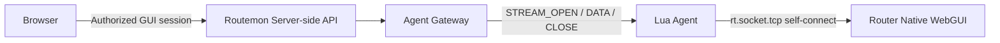

# WebGUI Relay Design

Status: Current specification  
Scope: Core  
Last updated: 2026-09-16

Related:

- `docs/core/access-control-design.md`(§5 Native WebGUI Access)
- `docs/core/agent-gateway-design.md`
- Agent Protocol: `docs/core/agent-protocol.md`

## 1. Purpose

本ドキュメントは、YAMAHA Native WebGUIをRoutemon経由で操作するWebGUI relayの現行仕様を定義する。Issue #1のRTX830実機PoCで成立を確認した内容と、採用済みの設計原則だけを記載する。

Router ↔ Agent Gateway間のTransportとSTREAM frameは`docs/core/agent-protocol.md`(§8 WebGUI stream semantics)に従う。旧Persistent Connection方式は本ドキュメントの対象外である。

---

## 2. Principles

- Router単体で完結する。LAN側補助Agentを置かない
- Lua AgentはRouter自身のWebGUIへlocal TCP接続する(`rt.socket.tcp()`による自己接続)
- Router自身以外への任意LAN pivot / SSRFを許可しない
- HTML / JavaScriptを再実装せず、native YAMAHA WebGUIをそのまま転送する
- 複数のbrowser connectionをStream IDでmultiplexする

---

## 3. Data path



- BrowserからのHTTP byte streamを、Agent Protocol上のSTREAM semantics(STREAM_OPEN / STREAM_DATA / STREAM_CLOSE / STREAM_ERROR)で中継する
- relayはfull-duplexとし、最初のrequestだけでなくPOST bodyの続きや同一connection上の後続requestも中継する
- Lua AgentはHTTPを解釈しない。必要なL7補正はServer側に置く(§6)

---

## 4. Target

接続先はRouter自身のWebGUIに固定する。

- 接続先IP / portはAgent側で固定し、Browser / Server側から任意のRouter / LAN addressを指定できない
- GUI sessionは認可済みのDeviceへscopeする

---

## 5. Session relay

Issue #1で確認した事実:

- 自己接続では、Router側のlogin / administrator password設定の有無にかかわらず、WebGUIのBasic認証が要求されない
- YAMAHA WebGUIは`HTTPD_SESSION_ID`をHTML hidden field + POST bodyで利用する。raw relayで透過すれば、`HTTPD_SESSION_ID`を必要とする操作(例: コマンド実行画面)が成立する

要件:

- `HTTPD_SESSION_ID`はraw relayで透過し、Server側で解析・保存しない
- 以下は別物として管理し、1つの値を使い回さない

```text
Routemon login session
Routemon WebGUI relay session
RTX HTTPD_SESSION_ID
TCP logical stream
```

- YAMAHA管理パスワードをRoutemonへ登録しない
- Authorization headerをaudit / debug logへ出力しない

---

## 6. L7 correction

Lua AgentはHTTPを理解させず、L7補正はServer側に置く。補正は必要性が確認されたものだけに限る。

現在必要な補正:

- `/define.js`のレスポンスで`HTTPD_ACCESS: "GFW"`を`HTTPD_ACCESS: "DIRECT"`へ書き換える

自己接続をRouterがGFW経由アクセスと判定し、WebGUI側のpath組み立てが壊れる問題への対処である(Issue #1で実機調査により特定)。

Host / Location / Cookieの書き換えは、必要性が確認された場合だけ行う。HTMLを書き換える方式を初期実装にしない。

---

## 7. Authorization

- Native WebGUIはAdmin only。Viewerは利用できない
- 権限確認はAgent GatewayへStreamを開く前に行う
- Native WebGUI内部のURL / POST / HTML / JavaScriptをViewer向けにfilterしない

詳細は`docs/core/access-control-design.md` §5に従う。relayしたHTTP body自体を監査目的で保存しない。

---

## 8. Browser entry

BrowserがDeviceのNative WebGUIへ到達する方式(#27で決定)。

```text
Routemon GUI(Admin)
  -> POST /api/devices/{id}/webgui-sessions   -- 認可・監査(access-control-design §5・§6)
  -> 返ってきたURLを新しいtabで開く
  -> GET <gui origin>/session/<session id>    -- session cookieを発行し / へredirect
  -> 以後、そのoriginへの要求はcookieのsessionでDeviceを決める
```

- **WebGUI転送専用のorigin**(Routemon本体とは別のportまたはhostname)で受ける。origin全体が転送先のGUIになるため、`/define.js`のようなroot-relative URLがそのまま動き、HTML / JavaScriptを書き換えずに済む(§6)
- Wildcard DNS / Wildcard証明書を必要としない。Communityでは同じhostnameの別portをCaddyで終端する
- session cookieはhttpOnly / SameSite=Laxで、Routemon本体のlogin sessionとは別物(§5)
- Routemonのsession cookieをRouterへ転送しない
- **同時に開けるNative WebGUIは1つ**(originごとにcookieが1つのため)。複数Deviceを同時に開く必要が出た場合は、Deviceごとのhostnameまたはport rangeを検討する
- session終了後の要求は転送しない

## 9. Verified scope

Issue #1(2026-09-08)でRTX830実機のrelay経由により、以下が60秒以上安定して利用できることを確認した。

- 標準WebGUI(トップページ、ダッシュボード、詳細設定)
- 複数画面遷移
- GET / POST(POST bodyを細かく分割しても欠落なし)
- `HTTPD_SESSION_ID`を必要とする操作
- LANマップ
- 複数XHR / AJAX(ダッシュボードの継続的ポーリング)

複数のGatewayによるfailoverは、現在の実装の範囲外である。

#27の本実装(`apps/community/src/webgui/relay.ts`)でも、RTX830実機で以下を確認した。

- Routemon GUIのsessionからNative WebGUIを開き、トップページ・`/dashboard/`・`/define.js`が正しく表示される
- `/define.js`の`HTTPD_ACCESS`書き換えが効いている
- 12リソース同時取得(計1.18 MB)が最大1.4〜1.8秒で、すべて参照bodyとバイト一致
